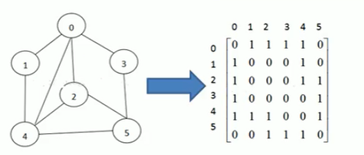
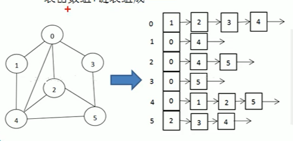
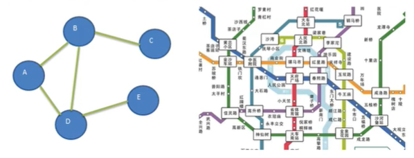

### 图
处理多对多关系

#### 图的概念
1. 顶点
2. 边
3. 路径
4. 无向图
5. 有向图
6. 带权图

#### 图的表示方式
1. 邻接矩阵（二维数组）
  
2. 领接表（链表）
  



```java
package graph;

import java.util.ArrayList;
import java.util.Arrays;

public class Graph {
	private ArrayList<String> vertexList;// 存储顶点集合
	private int[][] edges;// 存储图对应的邻接矩阵
	private int numOfEdges; // 表示边的数目
	public static void main(String[] args) {
		int n = 5;// 节点个数
		String Vertexs[] = {"A","B","C","D","E"};
		// 创建图对象
		Graph graph = new Graph(n);
		// 添加顶点
		for(String VertexValue: Vertexs) {
			graph.insertVertex(VertexValue);
		}
		// 添加边
		graph.insertEdge(0, 1, 1);
		graph.insertEdge(0, 2, 1);
		graph.insertEdge(1, 2, 1);
		graph.insertEdge(1, 3, 1);
		graph.insertEdge(1, 4, 1);
		graph.showGraph();

	}
	
	// 构造器
	public Graph(int n) {
		// 初始化邻接矩阵和邻接表
		edges = new int[n][n];
		vertexList = new ArrayList<String>(n);
		numOfEdges = 0;
	}
	
	// 插入节点
	public void insertVertex(String vertex) {
		vertexList.add(vertex);
	}
	
	// 得到顶点个数
	public int getNumOfVertex() {
		return vertexList.size();
	}
	// 得到边个数
	public int getNumOfEdges() {
		return numOfEdges;
	}
	// 返回i对应的数据 0->A
	public String getValueByIndex(int i) {
		return vertexList.get(i);
	}
	// 返回v1,v2的权值
	public int getWeight(int v1, int v2) {
		return edges[v1][v2];
	}
	// 显示图对应的矩阵
	public void showGraph() {
		for(int [] link:edges) {
			System.err.println(Arrays.toString(link));
		}
	}
	
	// 添加边
	/**
	 * @param v1 表示点的下标 第几个顶点
	 * @param v2 
	 * @param weight 权值
	 * */
	public void insertEdge(int v1, int v2, int weight) {
		edges[v1][v2] = weight;
		edges[v2][v1] = weight;
		numOfEdges++;
	}
}

```

### 图的深度优先遍历DFS
思想：
从初始访问节点触发，首先访问第一个邻接节点，然后再以这个被访问的邻接节点作为初始节点，访问他的第一个邻接节点。
实现：
```java 
```
### 图的广度优先遍历