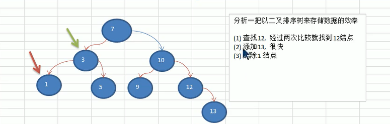
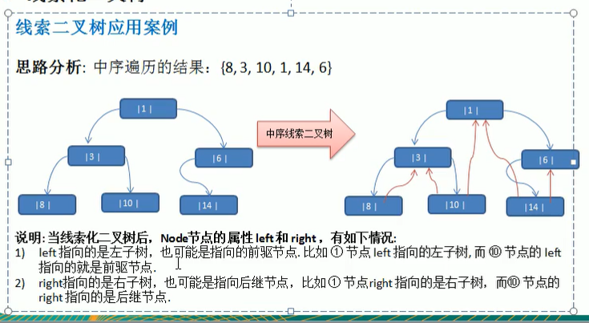
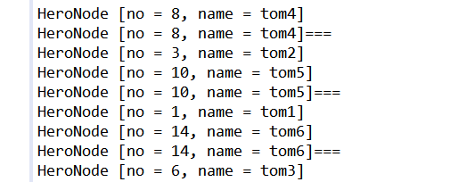
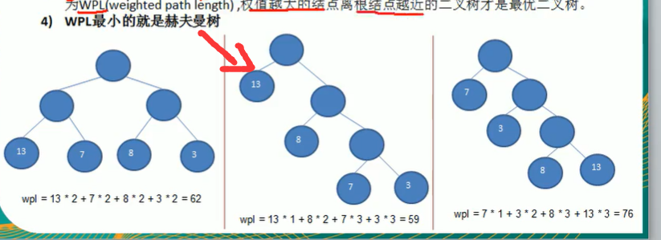
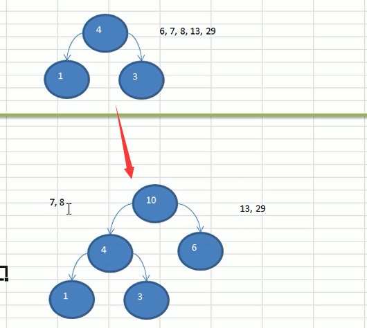
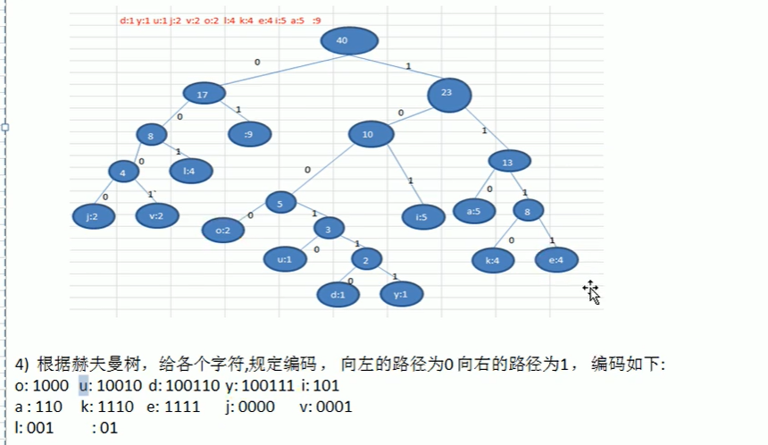
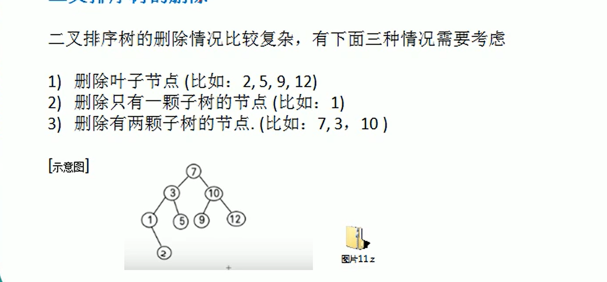
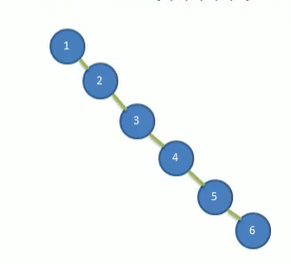
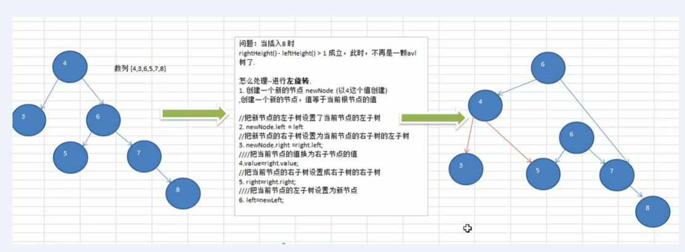
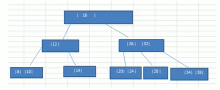

### 树
为什么需要树？
- 数组存储方式：
  - 优点：使用下标访问元素，访问快
  - 缺点：插入值会导致整体移动，效率较低
- 链式存储方式
  - 缺点：进行检索时，需要从头开始遍历
- 树存储方式
  - 能提高数据存储，读取的效率，比如利用二叉排序树，既可以包着数据的检索速度，同时也可以保证数据的插入，删除，修改速度。


#### 二叉树
- 每个节点最多只能有两个子节点。
- 二叉树的子节点分别为左节点和右节点。
  
**满二叉树**: 所有叶子节点都在最后一层，并且节点总数=2^n-1，n为层数。
**完全二叉树**: 除了叶子节点都有左右子节点。


#### 二叉树的遍历
（根据输出父节点的顺序，判断是哪一种遍历）
从根节点开始遍历
**前序遍历**
先输出父节点，再遍历左子树和右子树。
步骤：
1. 先输出当前节点 
2. 如果左子节点不为空，则递归继续前序遍历
3. 如果右子节点不为空，则递归继续前序遍历
   
**中序遍历**
先遍历左子树，再输出父节点，再遍历右子树
1. 如果左子节点不为空，则递归中序遍历
2. 输出当前节点
3. 如果当前节点的右子节点不为空，则递归进行中序遍历 
   
**后序遍历**
先遍历左子树，在遍历右子树，最后输出父节点
1. 如果当前节点的左子节点不为空，则递归后序遍历。
2. 如果当前节点的右子节点不为空，则递归后序遍历
3. 输出当前节点

```java
package tree;

public class BinaryTreeDemo {

	public static void main(String[] args) {
		BinaryTree binaryTree = new BinaryTree();
		// 创建需要的节点
		HeroNode root = new HeroNode(1,"宋江");
		HeroNode node2 = new HeroNode(2,"吴用");
		HeroNode node3 = new HeroNode(3,"卢俊义");
		HeroNode node4 = new HeroNode(4,"林冲");
		HeroNode node5 = new HeroNode(5,"关胜");
		
		// 我们先手动创建二叉树，后面学习递归的方式
		root.setLeft(node2);
		root.setRight(node3);
		node3.setRight(node4);
		node3.setLeft(node5);
		binaryTree.setRoot(root); 
		binaryTree.preOrder();//21354
		System.out.println("==========");
		binaryTree.infixOrder();//21534
		System.out.println("==========");
		binaryTree.postOrder();// 24531
	}

}

// 定义BinaryTree 二叉树
class BinaryTree {
	private HeroNode root;
	public void setRoot(HeroNode root) {
		this.root= root;
	}
	
	// 前序遍历
	public void preOrder() {
		if(this.root == null) {
			System.out.println("当前二叉树为空，无法遍历");
		} else {
			this.root.preOrder();
		}
	}
	public void infixOrder() {
		if(this.root == null) {
			System.out.println("当前二叉树为空，无法遍历");
		} else {
			this.root.infixOrder();
		}
	}
	public void postOrder() {
		if(this.root == null) {
			System.out.println("当前二叉树为空，无法遍历");
		} else {
			this.root.postOrder();
		}
	}
}
 
// 先创建HeroNode节点
class HeroNode {
	private int no;
	private String name;
	private HeroNode left;
	private HeroNode right;
	public HeroNode(int no, String name) {
		this.no = no;
		this.name = name;
	}
	public int getNo() {
		return no;
	}
	public void setNo(int no) {
		this.no = no;
	}
	public String getName() {
		return name;
	}
	public void setName(String name) {
		this.name = name;
	}
	public HeroNode getLeft() {
		return left;
	}
	public void setLeft(HeroNode left) {
		this.left = left;
	}
	public HeroNode getRight() {
		return right;
	}
	public void setRight(HeroNode right) {
		this.right = right;
	}
	@Override
	public String toString() {
		return "HeroNode [no = " + no + ", name = " + name + "]";
	}
	
	// 编写前序遍历的方法
	public void preOrder() {
		System.out.println(this);// 先输出父节点；
		// 递归向左子树前序遍历
		if(this.left != null) {
			this.left.preOrder();
		}
		// 递归向右子树前序遍历
		if(this.right != null) {
			this.right.preOrder();
		}
	}
	
	// 编写中序遍历
	public void infixOrder() {
		if(this.left != null) {
			this.left.infixOrder();
		}
		// 输出父节点
		System.out.println(this);// 先输出父节点；
		// 递归向右子树中序遍历
		if(this.right != null) {
			this.right.infixOrder();
		}
	}
	
	// 编写后序遍历
	public void postOrder() {
		if(this.left != null) {
			this.left.postOrder();
		}
		if(this.right != null) {
			this.right.postOrder();
		}
		System.out.println(this);// 先输出父节点；
	}
}

```


#### 顺序存储二叉树
思想：
从数据存储来看，数组存储方式和树的存储方式可以相互转换，既数组可以转换成树，树也可以转换成数组。
特点：
(顺序二叉树只考虑完全二叉树)
- 第n个元素的左子节点为 2*n+1
- 第n个元素的右子节点为 2*n+2
- 第n个元素的父节点为(n-1)/2
  
```java
	// 编写一个方法，完成顺序存储二叉树的前序遍历
	public void preOrder(int index) {
		if(arr == null || arr.length == 0) {
			System.out.println("数组为空，不能按照二叉树的前序遍历");
		}

		// 向左递归
		if(index * 2 + 1 < arr.length) {
			preOrder(2 * index + 1);
		}
		System.out.println(arr[index]);
		// 向右递归
		if(index * 2 + 2 < arr.length) {
			preOrder(2 * index + 2);
		}
	}
```

#### 线索化二叉树
思想：
n个节点的二叉链表中含有n+1个空指针域，利用二叉链表中的空指针域，存放指向该节点在某种遍历次序下的前驱和后继节点的指针（这种附加指针成为线索）


```java
// 编写对二叉树进行中序遍历的方法
// node是当前需要线索化的节点
public void threadedNodes(HeroNode node) {
  if(node == null) {
    return;
  }
  // 先线索化左子树
  threadedNodes(node.getLeft());
  // 线索化当前节点 
  // 先处理当前节点的前驱节点
  if(node.getLeft() == null) {
    // 让当前节点的左指针指向前驱结点
    node.setLeft(pre);
    // 修改当前节点的左指针的类型
    node.setLeftType(1);
  }
  if(pre!= null && pre.getRight() == null) {
    pre.setRight(node);
    pre.setRightType(1);
  }
  // 每处理一个节点后，让当前节点成为下一个节点的前驱节点
  pre = node;
  
  // 线索化右子树
  threadedNodes(node.getRight());
}
```
注意：当线索化二叉树后不能使用原来的遍历方式

#### 遍历线索化二叉树

```java
// 遍历线索化二叉树的方法
public void threadedList() {
  HeroNode node = root;
  while(node != null) {
    while(node.getLeftType()==0) {
      node = node.getLeft();
    }
    System.out.println(node);
    while(node.getRightType() == 1) {
      System.out.println(node + "===");
      node = node.getRight();
      System.out.println(node);
    }
    node = node.getRight();
  }
}
```


#### 树结构的应用之堆排序
堆排序的基本思想
1. 将待排序序列构造成一个大顶堆
2. 此时，整个序列的最大值就是堆顶的根节点
3. 将其与末尾元素进行交换，此时末尾就为最大值
4. 将剩余n-1个元素重新构造成一个堆，这样就会得到n个元素的次小值，如此反复执行，便能得到一个有序序列

#### 堆排序思路
1. 将无序序列构建成一个大顶堆
2. 将堆顶元素与末尾元素交换，将最大元素放到数组末端
3. 重新调整结构，使其满足堆定义，然后继续交换堆顶元素和当前末尾元素，直到整个序列有序

```java
public class HeapSort {
	public static void main(String[] args) {
		int[] arr = { 4, 6, 8, 5, 9,10,11 };
		headSort(arr);
	}

	// 堆排序方法
	public static void headSort(int arr[]) {
		int temp = 0;
//		adjustHeap(arr, 1, arr.length);
//		System.out.println("" + Arrays.toString(arr));
//		adjustHeap(arr, 0, arr.length);
//		System.out.println("" + Arrays.toString(arr));

//		// 把整个数组构造成大顶堆
		for(int i = arr.length/2-1; i>=0;i--) {
			adjustHeap(arr, i, arr.length);
		}
		
		// 将栈顶元素与末尾交换
		for(int j = arr.length - 1; j>0;j--) {
			// 交换
			temp = arr[j];
			arr[j] = arr[0];
			arr[0] = temp;
			adjustHeap(arr, 0, j);
		}
		System.out.println("" + Arrays.toString(arr));
	}

	// 将一个数组（二叉树）调整成一个大顶堆
	// 功能：将以i为非叶子节点所对应的树调整成大顶堆（root = i）。
	/**
	 * @param arr    待调整的数组
	 * @param i      表示非叶子节点在数组中索引
	 * @param length 表示多少个元素继续调整，length在逐渐减少
	 */
	public static void adjustHeap(int arr[], int i, int length) {
		
		int temp = arr[i];// 保存当前以i为根节点的i的值
		// k = i*2 +1是i节点的左子节点
		for (int k = i * 2 + 1; k < length; k = k * 2 + 1) {
			if (k + 1 < length && arr[k] < arr[k + 1]) { // 说明左子节点的值小于右子节点的值
				k++;
			}
			if (arr[k] > temp) { // 如果子节点大于父节点
				arr[i] = arr[k]; // 把较大的值赋给当前节点
				i = k; // 将i 执行k，继续循环比较
			} else {
				break;
			}
		}
		// 当for循环结束后，我们将以i为父节点的树的最大值，放在了最顶部root
		arr[i] = temp;// 将temp调整到最后
	}
}
```
   
#### 树结构的应用之赫夫曼树
- 给定n个权值作为n个叶子结点，构造一颗二叉树，若该树的带权路径长度wpl达到最小，称这样的二叉树为最优二叉树，也称为哈夫曼树。
- 赫夫曼树是带权路径长度最短的树，权值较大的节点离根较近。

#### 赫夫曼树的重要概念
1. 路径和路径长度：在一棵树中，从一个节点往下可达到的孩子或孙子节点之间的通路，称为路径。通路中分支的数目称为路径长度。
2. 节点的权和带权路径长度：若将树中节点赋给一个有着某种意义的数值，则这个数值称为该节点的权。节点的带权路径长度为：从根节点到该节点之间的路径长度与该节点的的权的乘积。
3. 树的带权路径长度（wpl）：所有叶子节点的带权路径长度之和。
4. wpl最小的就是赫夫曼树



#### 构建一颗赫夫曼树
思路分析：
1. 数组从小到大进行排序，每一个数据都是一个节点，每个节点看出是一颗最简单的二叉树
2. 取出权值最小的两颗二叉树
3. 组成一个新的二叉树，该新的二叉树的根节点的权值是前面两颗二叉树根节点的权值的和
4. 再将上一步的根节点的权值根据剩余数据的大小进行排序，不断重复直到数组中所有的数据都被处理，就得到一颗赫夫曼树

示例：
给你一个数列{13,7,8,3,29,6,1},要求转成一颗赫夫曼树。

```java
package huffmantree;

import java.util.ArrayList;
import java.util.Collections;
import java.util.List;

public class HfuumanTree {
	public static void main(String[] args) {
		int arr[] = {13,7,8,3,29,6,1};
		Node root = crateHuffmanTree(arr);
		
		// 测试
		preOrder(root);
	}
	
	// 编写一个前序遍历的方法
	public static void preOrder(Node root) {
		if(root != null) {
			root.preOrder();
		} else {
			System.out.println("空树不能遍历");
		}
	}
	
	// 创建赫夫曼树
	public static Node crateHuffmanTree(int[] arr) {
		// 将arr每个元素变成Node
		List<Node> nodes = new ArrayList<Node>();
		for(int value:arr) {
			nodes.add(new Node(value));
		}
		while(nodes.size() > 1) {
			// 1.排序从小到大
			Collections.sort(nodes);
			System.out.println(nodes);
			
			// 2.取出根节点权值最小的两颗二叉树
			Node leftNode = nodes.get(0);
			Node rightNode = nodes.get(1);
			// 3.构建成一个新的二叉树
			Node parent = new Node(leftNode.value + rightNode.value);
			parent.left = leftNode;
			parent.right = rightNode;
			// 4.删除处理过的二叉树
			nodes.remove(leftNode);
			nodes.remove(rightNode);
			// 5.将parent加入到nodes
			nodes.add(parent);
			
			System.out.println(nodes);
		}
		
		// 返回赫夫曼树的root节点
		return nodes.get(0);
	}
	
}

// 创建节点类
// 为了让Node 对象支持排序Collections集合排序
class Node implements Comparable<Node> {
	int value; // 节点权值
	Node left; // 左子节点
	Node right; // 右子节点
	
	public Node(int value) {
		this.value = value;
	}
	
	// 赫夫曼树的前序遍历
	public void preOrder() {
		System.out.println(this);
		if(this.left != null) {
			this.left.preOrder();
		} 
		if(this.right != null) {
			this.right.preOrder();
		} 
	}
	
	@Override
	public String toString() {
		return "Node [value=" + value + "]";
	}
	
	@Override 
	public int compareTo(Node o) {
		return this.value - o.value;
	}
}

```

#### 赫夫曼编码实现
- 满足前缀编码，既字符的编码不能是其他字符编码的前缀，不会造成匹配的多异性。
- 无损的处理方案


**使用赫夫曼树进行数据压缩**
给出一段文本
"i like like like java do you like a java"
对其进行数据压缩处理
```java
package huffmancode;

import java.util.ArrayList;
import java.util.Collections;
import java.util.HashMap;
import java.util.List;
import java.util.Map;

public class HuffmanCode {

	public static void main(String[] args) {
		// TODO Auto-generated method stub
		String content = "i like like like java do you like a java";
		byte[] contentBytes = content.getBytes();
		System.out.println(contentBytes.length);// 40
		List<Node> nodes = getNodes(contentBytes);
//		System.out.println("nodes = " + nodes);
		
		System.out.println("赫夫曼树");
		Node huffmanTreeRoot = createHuffmanTree(nodes);
//		huffmanTreeRoot.preOrder();
		getCodes(huffmanTreeRoot, "", stringBuilder);
		System.out.println("生成的哈夫曼编码表： " + huffmanCodes);
	}
	
	// 32->01 97->100
	static Map<Byte, String> huffmanCodes = new HashMap<Byte,String>();
	// 拼接路径
	static StringBuilder stringBuilder = new StringBuilder();
	
	/**
	 * 功能： 将传入的node节点的所有叶子节点的赫夫曼树编码得到并放入huffmanCodes集合
	 * @param node 传入节点
	 * @param code 路径： 左子节点0 右子节点1
	 * @param stringBuilder 用于拼接路径
	 * */	
	private static void getCodes (Node node, String code, StringBuilder stringBuilder) {
		StringBuilder stringBuilder2 = new StringBuilder(stringBuilder);
		stringBuilder2.append(code);
		if(node != null) {
			// 判断当前node是叶子节点还是非叶子节点
			if(node.data == null) {
				// 递归处理
				getCodes(node.left, "0", stringBuilder2);
				getCodes(node.right, "1", stringBuilder2);
			} else {// 说明是叶子节点
				// 表示找到了某个叶子节点 也就是到头了
				huffmanCodes.put(node.data, stringBuilder2.toString());
			}
		}
	}

	private static List<Node> getNodes(byte[] bytes) {
		ArrayList<Node> nodes = new ArrayList<Node>();
		Map<Byte, Integer> counts = new HashMap<>();
		for (byte b : bytes) {
			Integer count = counts.get(b);
			if (count == null) {
				counts.put(b, 1);
			} else {
				counts.put(b, count + 1);
			}
		}
		for (Map.Entry<Byte, Integer> entry : counts.entrySet()) {
			nodes.add(new Node(entry.getKey(), entry.getValue()));
		}
		return nodes;
	}
	
	// 通过list 创建对应的赫夫曼树
	private static Node createHuffmanTree(List<Node> nodes) {
		while(nodes.size() > 1) {
			// 排序
			Collections.sort(nodes);
			// 取出最低两位
			Node leftNode = nodes.get(0);
			Node rightNode = nodes.get(1);
			// 创建新的二叉树
			Node parent = new Node(null, leftNode.weight + rightNode.weight);
			parent.left = leftNode;
			parent.right = rightNode;
			// 已经处理的两颗二叉树移除
			nodes.remove(leftNode);
			nodes.remove(rightNode);
			// 将新的二叉树加入nodes
			nodes.add(parent);
		}
		// 最后的节点就是哈夫曼树的根节点
		return nodes.get(0);
	}
}

// 创建Node, 带数据和权值
class Node implements Comparable<Node> {
	Byte data; // 存放数据本身 a => 97
	int weight; // 表示字符出现的次数
	Node left;
	Node right;

	public Node(Byte data, int weight) {
		this.data = data;
		this.weight = weight;
	}

	@Override
	public int compareTo(Node o) {
		return this.weight - o.weight;
	}

	@Override
	public String toString() {
		return "Node [data =" + data + " weight = " + weight + "]";
	}

	// 前序遍历
	public void preOrder() {
		System.out.println(this);
		if (this.left != null) {
			this.left.preOrder();
		}
		if (this.right != null) {
			this.right.preOrder();
		}
	}
}
```


#### 二叉排序树
对于二叉排序树的任何一个非叶子节点，要求左子节点的值比当前节点的值小，右子节点的值比当前节点的值大，相同放左右都行。

**二叉排序树的创建**
```java
package binarysorttree;

public class BinarySortTreeDemo {

	public static void main(String[] args) {
		int[] arr = {7,3,10,12,5,19};
		BinarySortTree binarySortTree = new BinarySortTree();
		// 循环添加节点
		for(int i = 0;i<arr.length;i++) {
			binarySortTree.add(new Node(arr[i]));
		}
		binarySortTree.infixOrder();
	}

}

// 创建二叉排序树
class BinarySortTree {
	private Node root;
	public void add(Node node) {
		if(root == null) {
			root = node;// 如果root为空则直接让root指向node
		} else {
			root.add(node);
		}
	}
	
	public void infixOrder() {
		if(root != null) {
			root.infixOrder();
		}
	}
}

class Node {
	int value;
	Node left;
	Node right;
	public Node(int value) {
		this.value = value;
	}
	
	@Override
	public String toString() {
		return "node [value=" + value + "] ";
	}
	
	// 递归的形式添加节点，需要满足二叉排序树的要求
	public void add(Node node) {
		if(node == null) {
			return;
		}
		// 判断传入的节点的值和当前子树的根节点的值关系
		if(node.value < this.value) {
			if(this.left == null) {
				this.left = node;
			} else {
				this.left.add(node);
			}
		} else {
			if(this.right == null) {
				this.right = node;
			} else {
				this.right.add(node);
			}
		}
	}
	
	// 中序遍历方法
	public void infixOrder() {
		if(this.left != null) {
			this.left.infixOrder();
		}
		System.out.println(this);
		if(this.right != null) {
			this.right.infixOrder();
		}
	}
}


```

**二叉排序树删除节点的三种情况**
1. 删除叶子节点
   1. 找到要删除节点的父节点
   2. 判断是父节点的左子节点还有右子节点
   3. 删除
   
2. 删除只有一颗子树的节点
   1. 找到要删除的节点的父节点
   2. 确定要删除的节点的子节点是左子节点还是右子节点
   3. 要删除节点是父节点的左子节点还是右子节点
   4. 要删节点只有左子节点
      1. 如果要删节点是父节点的左子节点
         1. parent.left = targetNode.left
      2. 如果要删节点是父节点的右子节点
         1. parent.right = targetNode.left
   5. 要删节点只有右子节点
      1. 如果要删节点是父节点的左子节点
         1. parent.left = targetNode.right
      2. 如果要删节点是父节点的右子节点
         1. parent.right = targetNode.right
(简单来说就是parent的左都小于parent,parent的右都大于perent)
3. 删除有两颗子树的节点
   1. 找到要删除节点的父节点
   2. 从要删除节点的右边找到最小的节点
   3. 用一个临时变量，将最小节点的值保存
   4. 删除该最小节点
   5. 用找到的最小节点替换要删除的节点
      1. targetNode.value = temp
   

```java
package binarysorttree;

public class BinarySortTreeDemo {

	public static void main(String[] args) {
		int[] arr = {7,3,10,12,5,19,2,1};
		BinarySortTree binarySortTree = new BinarySortTree();
		// 循环添加节点
		for(int i = 0;i<arr.length;i++) {
			binarySortTree.add(new Node(arr[i]));
		}
		binarySortTree.infixOrder();
		binarySortTree.delNode(0);
		System.out.println("删除节点后");
		binarySortTree.infixOrder();
	}

}

// 创建二叉排序树
class BinarySortTree {
	private Node root;
	
	// 查找要删除的节点
	public Node search(int value) {
		if(root == null) {
			return null;
		} else {
			return root.search(value);
		}
	}
	// 查找父节点
	public Node searchParent(int value) {
		if(root == null) {
			return null;
		} else {
			return root.searchParent(value);
		}
	}
	
	// 删除节点
	public void delNode(int value) {
		if(root == null) {
			return;
		} else {
			if(root.left == null && root.right == null) {
				root = null;
				return;
			}
			// 1. 找到要删除的节点
			Node targetNode = search(value);
			if(targetNode == null) {
				return;
			}
			// 2. 找到要删除节点的父节点
			Node parent = searchParent(value);
			// 如果要删除节点是叶子结点
			if(targetNode.left == null && targetNode.right == null) {
				// 判断targetNode是父节点的左还是右子节点
				if(parent.left != null && parent.left.value == value) {
					parent.left = null;
				} else if(parent.right != null && parent.right.value == value) {
					parent.right = null;
				}
			} else if(targetNode.left != null && targetNode.right != null) {// 删除的节点是有两颗子树的节点
				int minVal = delRightTreeMin(targetNode.right);
				targetNode.value = minVal;
			} else { // 剩下的自然是要删除的节点只有一个子节点的情况
				// 如果要删除的节点有左子节点
				if(targetNode.left != null) {
					if(parent != null) {
						// 如果targetNode是parent的左子节点
						if(parent.left.value == value) {
							parent.left = targetNode.left;
						} else {
							// 如果targetNode是parent的左子节点
							parent.right = targetNode.left;
						}
					} else {
						root = targetNode.left;
					}

				} else {
					if(parent != null) { 
						if(parent.left.value == value) {
							parent.left = targetNode.right;
						} else {
							parent.right = targetNode.right;
						}
					} else {
						root = targetNode.right;
					}
				}
			}
		}
	}
	
	// 1. 返回以node为根节点的二叉排序树的最小节点的值
	// 2. 删除以node为根节点的二叉排序树的最小节点
	/**
	 * @param node 传入的节点（当做二叉排序树的根节点）
	 * @param return 返回以node为根节点的二叉排序树的最小节点
	 * */
	public int delRightTreeMin(Node node) {
		Node target = node;
		// 循环查找左子节点，就会找到最小值
		while(target.left != null) {
			target = target.left;
		}
		// 此时target就指向了最小节点
		// 删除最小节点
		delNode(target.value);
		return target.value;
	}
	
	public void add(Node node) {
		if(root == null) {
			root = node;// 如果root为空则直接让root指向node
		} else {
			root.add(node);
		}
	}
	
	public void infixOrder() {
		if(root != null) {
			root.infixOrder();
		}
	}
}

class Node {
	int value;
	Node left;
	Node right;
	public Node(int value) {
		this.value = value;
	}
	
	// 查找要删除的节点
	/**
	 * @param value 希望删除的节点的值
	 * @param 找到返回，否则null
	 * */
	public Node search(int value) {
		if(value == this.value) {
			return this;
		} else if (value < this.value) {// 如果查找的值小于当前节点，向左子树递归查找
			if(this.left == null) {
				return null;
			}
			return this.left.search(value);
		} else {
			if(this.right == null) {
				return null;
			}
			return this.right.search(value);
		}
	}
	
	// 查找要删除的节点的父节点
	public Node searchParent(int value) {
		if((this.left != null && this.left.value == value) ||
			(this.right != null && this.right.value == value)) {
			return this;
		} else {
			if(value < this.value && this.left != null) {
				return this.left.searchParent(value);
			} else if(value >= this.value && this.right != null) {
				return this.right.searchParent(value);
			} else {
				return null;
			}
		}
	}
	
	@Override
	public String toString() {
		return "node [value=" + value + "] ";
	}
	
	// 递归的形式添加节点，需要满足二叉排序树的要求
	public void add(Node node) {
		if(node == null) {
			return;
		}
		// 判断传入的节点的值和当前子树的根节点的值关系
		if(node.value < this.value) {
			if(this.left == null) {
				this.left = node;
			} else {
				this.left.add(node);
			}
		} else {
			if(this.right == null) {
				this.right = node;
			} else {
				this.right.add(node);
			}
		}
	}
	
	// 中序遍历方法
	public void infixOrder() {
		if(this.left != null) {
			this.left.infixOrder();
		}
		System.out.println(this);
		if(this.right != null) {
			this.right.infixOrder();
		}
	}
}

```


#### 平衡二叉树 AVL Tree
给一个数列{1,2,3,4,5,6},这样子的二叉排序树更像是一个单链表，但是查询速度明显降低，不能发挥二叉排序树的优势，因为每次都要比较左子树，其查询速度比单链表还慢。

于是有了平衡二叉树
**平衡二叉树的特点**
1. 他是一颗空树或者他的左右两个子树的高度差绝对值不超过1，并且左右两个子树都是一颗平衡二叉树。

**平衡二叉树的实现**
1. 红黑树
2. AVL
3. 替罪羊树
4. Treap
5. 伸展树

**左旋转**
步骤：
1. 创建一个新的节点newNode，值等于当前根节点的值
2. 把新节点的左子树设置成当前根节点的左子树
3. 把当前新节点的右子树设置成当前根节点的右子树的左子树
4. 把当前根节点的值设置成右子节点的值
5. 把当前根节点的右子树设置成右子树的右子树
6. 把当前根节点的左子树设置成新节点
 
```java
// 左旋转的方法 （右旋转同理）
private void leftRotate() {
  // 1. 创建新的节点，以当前节点的值创建
  Node newNode = new Node(value);
  // 2. 把新的节点的左子树设置成当前节点的左子树
  newNode.left = left;
  // 3. 把新的节点的右子树设置成当前节点的右子树的左子树
  newNode.right = right.left;
  // 4. 把当前节点的值换成右节点的值
  value = right.value;
  // 5. 把当前节点的右节点换成右节点的右节点的值
  right = right.right;
  // 6. 把当前节点的左节点换成新节点
  left = newNode;
}
```

完整代码
```java
package avl;


public class AVLTreeDemo {

	public static void main(String[] args) {
		int[] arr = {4,3,6,5,7,8};
		AVLTree avlTree = new AVLTree();
		for(int i=0;i<arr.length;i++) {
			avlTree.add(new Node(arr[i]));
		}
		avlTree.infixOrder();
		System.out.println("没平衡处理之前");
		System.out.println("树的高度" + avlTree.getRoot().height());
		System.out.println("树的左子树的高度" + avlTree.getRoot().leftHeight());
		System.out.println("树的右子树的高度" + avlTree.getRoot().rightHeight());
		avlTree.getRoot().leftRotate();
		System.out.println("树的高度" + avlTree.getRoot().height());
		System.out.println("树的左子树的高度" + avlTree.getRoot().leftHeight());
		System.out.println("树的右子树的高度" + avlTree.getRoot().rightHeight());
	}

}

// 创建AVLTree
class AVLTree {
	private Node root;
	
	// 查找要删除的节点
	public Node search(int value) {
		if(root == null) {
			return null;
		} else {
			return root.search(value);
		}
	}
	// 查找父节点
	public Node searchParent(int value) {
		if(root == null) {
			return null;
		} else {
			return root.searchParent(value);
		}
	}
	
	// 删除节点
	public void delNode(int value) {
		if(root == null) {
			return;
		} else {
			if(root.left == null && root.right == null) {
				root = null;
				return;
			}
			// 1. 找到要删除的节点
			Node targetNode = search(value);
			if(targetNode == null) {
				return;
			}
			// 2. 找到要删除节点的父节点
			Node parent = searchParent(value);
			// 如果要删除节点是叶子结点
			if(targetNode.left == null && targetNode.right == null) {
				// 判断targetNode是父节点的左还是右子节点
				if(parent.left != null && parent.left.value == value) {
					parent.left = null;
				} else if(parent.right != null && parent.right.value == value) {
					parent.right = null;
				}
			} else if(targetNode.left != null && targetNode.right != null) {// 删除的节点是有两颗子树的节点
				int minVal = delRightTreeMin(targetNode.right);
				targetNode.value = minVal;
			} else { // 剩下的自然是要删除的节点只有一个子节点的情况
				// 如果要删除的节点有左子节点
				if(targetNode.left != null) {
					if(parent != null) {
						// 如果targetNode是parent的左子节点
						if(parent.left.value == value) {
							parent.left = targetNode.left;
						} else {
							// 如果targetNode是parent的左子节点
							parent.right = targetNode.left;
						}
					} else {
						root = targetNode.left;
					}

				} else {
					if(parent != null) { 
						if(parent.left.value == value) {
							parent.left = targetNode.right;
						} else {
							parent.right = targetNode.right;
						}
					} else {
						root = targetNode.right;
					}
				}
			}
		}
	}
	
	// 1. 返回以node为根节点的二叉排序树的最小节点的值
	// 2. 删除以node为根节点的二叉排序树的最小节点
	/**
	 * @param node 传入的节点（当做二叉排序树的根节点）
	 * @param return 返回以node为根节点的二叉排序树的最小节点
	 * */
	public int delRightTreeMin(Node node) {
		Node target = node;
		// 循环查找左子节点，就会找到最小值
		while(target.left != null) {
			target = target.left;
		}
		// 此时target就指向了最小节点
		// 删除最小节点
		delNode(target.value);
		return target.value;
	}
	
	public void add(Node node) {
		if(root == null) {
			root = node;// 如果root为空则直接让root指向node
		} else {
			root.add(node);
		}
	}
	
	public void infixOrder() {
		if(root != null) {
			root.infixOrder();
		}
	}
	
	public Node getRoot() {
		return this.root;
	}
}

class Node {
	int value;
	Node left;
	Node right;
	public Node(int value) {
		this.value = value;
	}
	
	// 返回左子树的高度
	public int leftHeight() {
		if(left == null) {
			return 0;
		}
		return left.height();
	}
	
	// 返回右子树的高度
	public int rightHeight() {
		if(right == null) {
			return 0;
		}
		return right.height();
	}
	
	// 返回以当前节点为根节点的树的高度
	public int height() {
		return Math.max(left == null ? 0 : left.height(), right == null ? 0:right.height()) + 1;
	}
	
	// 左旋转的方法
	public void leftRotate() {
		// 1. 创建新的节点，以当前节点的值创建
		Node newNode = new Node(value);
		// 2. 把新的节点的左子树设置成当前节点的左子树
		newNode.left = left;
		// 3. 把新的节点的右子树设置成当前节点的右子树的左子树
		newNode.right = right.left;
		// 4. 把当前节点的值换成右节点的值
		value = right.value;
		// 5. 把当前节点的右节点换成右节点的右节点的值
		right = right.right;
		// 6. 把当前节点的左节点换成新节点
		left = newNode;
	}
	
	// 右旋转
	private void rightRotate() {
		Node newNode = new Node(value);
		newNode.right = right;
		newNode.left = left;
		value = left.value;
		left = left.left;
		right = newNode;
	}
	
	// 查找要删除的节点
	/**
	 * @param value 希望删除的节点的值
	 * @param 找到返回，否则null
	 * */
	public Node search(int value) {
		if(value == this.value) {
			return this;
		} else if (value < this.value) {// 如果查找的值小于当前节点，向左子树递归查找
			if(this.left == null) {
				return null;
			}
			return this.left.search(value);
		} else {
			if(this.right == null) {
				return null;
			}
			return this.right.search(value);
		}
	}
	
	// 查找要删除的节点的父节点
	public Node searchParent(int value) {
		if((this.left != null && this.left.value == value) ||
			(this.right != null && this.right.value == value)) {
			return this;
		} else {
			if(value < this.value && this.left != null) {
				return this.left.searchParent(value);
			} else if(value >= this.value && this.right != null) {
				return this.right.searchParent(value);
			} else {
				return null;
			}
		}
	}
	
	@Override
	public String toString() {
		return "node [value=" + value + "] ";
	}
	
	// 递归的形式添加节点，需要满足二叉排序树的要求
	public void add(Node node) {
		if(node == null) {
			return;
		}
		// 判断传入的节点的值和当前子树的根节点的值关系
		if(node.value < this.value) {
			if(this.left == null) {
				this.left = node;
			} else {
				this.left.add(node);
			}
		} else {
			if(this.right == null) {
				this.right = node;
			} else {
				this.right.add(node);
			}
		}
		
		// 当添加完一个节点后，如果右子树高度-左子树高度大于1，左旋转
		if(rightHeight() - leftHeight() > 1) {
			leftRotate();
		}
		// 当添加完一个节点后，如果左子树高度-右子树高度大于1，右旋转
		if(leftHeight() - rightHeight() > 1) {
			rightRotate();
		}
	}
	
	// 中序遍历方法
	public void infixOrder() {
		if(this.left != null) {
			this.left.infixOrder();
		}
		System.out.println(this);
		if(this.right != null) {
			this.right.infixOrder();
		}
	}
}


```
#### B树（多叉树）
2-3树、2-3-4树就是多叉树
- B树能够重新组织节点，降低树的高度
#### 23树
2-3树是最简单的B树
2-3树有以下特点：
1. 2-3树的所有叶子节点都在同一层。（只要是b树都满足这个条件）
2. 有两个子节点的节点叫二节点，二节点要么没有子节点，要么有两个子节点。
3. 有三个子节点的节点叫做三节点，三节点要么没有子节点，要么有三个子节点
4. 2-3树是由二节点和三节点构成的树

例子：
将数列{16,24,12,32,14,26,34,10,8,28,38,20}构建成2-3树，并保证数据插入的大小顺序。

左小 中间介于父之间 右大于 