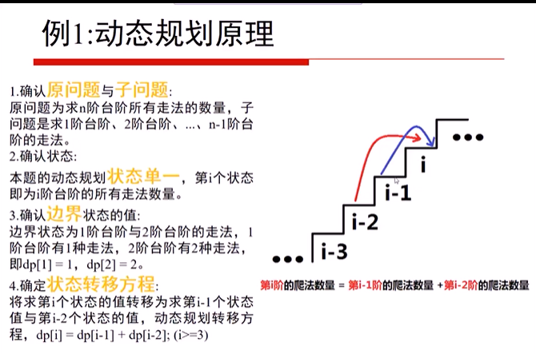
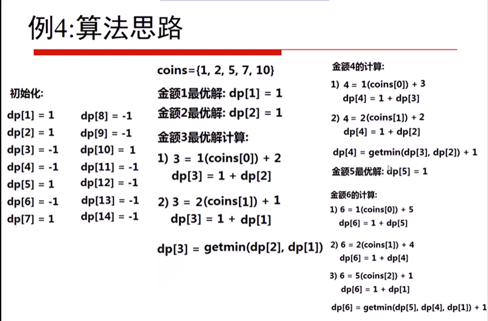

#### 二分查找算法(非递归)
```java
// 二分查找算法非递归实现
public static int binarySearch(int[] arr, int target) {
  int left = 0;
  int right = arr.length-1;
  while(left <= right) {
    int mid = (left + right) / 2;
    if(arr[mid] == target) {
      return mid;
    } else if(arr[mid] > target) {
      right = mid - 1;
    } else {
      left = mid + 1;
    }
  }
  return -1;
}
```
#### 分治算法
核心思想：
1. 将大问题分为小问题

汉诺塔
```java
public static void hannuota(int num, String a, String b, String c) {
  if(num == 1) {
    System.out.print("第一个盘从" + a + "到" + c);
  } else {
    // 如果n>=2的情况，我们总是可以看做是两个盘，1.最下面的一个盘2.上面的所有盘
    // 1. 最上面的所有盘移动到b
    hannuota(num - 1, a,c,b);
    // 2. 最下面的盘移动到b
    System.out.print("第"+ num + "个盘从" + a + "到" + c);
    // 3. b盘所有移动到c盘
    hannuota(num-1,b,a,c);
  }
}
```

#### 回溯


#### 贪心算法
集合覆盖问题
1. 先找最大值,再依次找次大值


#### 动态规划算法
利用各阶段之间的关系，逐个求解，最终求得全局最优解。在设计动态规划算法时，需要确认原问题和子问题，动态规划状态，边界状态结值，状态转移方程等关键要素。
解题思路
1. 确认原问题与子问题（枚举找规律）
2. 确认状态  
3. 确认边界状态的值
4. 确定状态转移方程


##### 背包问题
01背包：每种物品只能用1次
完全背包：每种物品无限条件使用


##### 走楼梯问题
十阶的楼梯，一次走两阶和一次走一阶，有多少种走法到第十阶？
1. 第十阶 等于先走一步 加上 n-1台阶的走法 加上 先走两步 加上n-2台阶的走法


#### 打家劫舍
一条直线, n个房屋, 每个房屋有数量不等的财报，不能连续偷两间房，最多可以获取多少财宝？
当前房间可分为选和不选：
1. 选第i个房间，第i个房间加前i-2个房间是最优解
2. 选第i-1个房间，前i-1个房间是最优解
3. 根据1,2得到动态规划转移方程
   dp[i] = max(dp[i-1] , dp[i-2] + nums[i])

代码实现：
```js
function rob(arr) {
  if(arr.length ==0) {
    return 0;
  }
  if(arr.length == 1) {
    return arr[i]
  }
  let dp=[]
  dp[0] = arr[0],
  dp[1] = Math.max(dp[0],arr[1])
  for(let i=2;i<arr.length;i++) {
    dp[i] = Math.max(arr[i]+dp[i-2],dp[i-1])
  }
  return dp[dp.length-1]
}
console.log(rob([5,1,6,3,7,1]))
```

##### 最大字段和
给定一个数组，求这个数组的连续子数组中，最大的那一段的和，如[-2,1,-3,4,-1,2,1,-5,4]
最大连续子数组为[4,-1,2,1],最大子数组和为6
```js
// i代表以i为结尾的最大子段和
function maxSubArray(arr) {
  let dp = []
  dp[0] = arr[0];
  let max = dp[0];
  for(let i=1;i<arr.length;i++) {
    dp[i] = Math.max(dp[i-1] + arr[i],arr[i]);
    if(max < dp[i]) {
      max=dp[i];
    }
  }
  return max;
}
```
##### 找零钱
已知不同面值的钞票，求如何用最少数量钞票组成某个金额,求可以使用的最少钞票数量.如何任意数量的已知面值钞票都无法组成该金额,则返回-1.
如:coins = [1,2,5,7,10] 11 = 5+5+1 需要三张

用dp数组存储金额1到14 也就是(1,2,5,7,10,14)的最优解
dp[i] 
1. i代表金额 
2. dp[i]代表金额i的最优解

金额i可由:
金额i-金额数组coins中每一项组合
i-1 既coins[0] 也就是 1 组成有关;
i-2 既coins[1] 也就是 2 组成有关;
i-5 既coins[2] 也就是 5 组成有关;
...

由于面值的钱要用最少
故dp[i] = min(dp[i-1],dp[i-2],dp[i-5],dp[i-7],dp[i-10]) + 1
下图括号是解释



