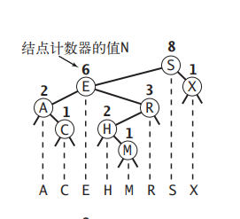
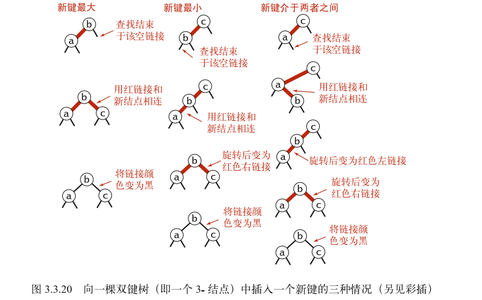

### 符号表
符号表的基本单位是节点, 节点包含键值对, 键不可重复,每次put键,若存在键,则修改该值.
符号表的实现
1. 基于链表 查N 改N
2. 基于有序数组的二分查找 查 logN 改2n-n
3. 基于二叉查找树 查N-1.39logN 改N-1.39logN
```js
// 基于二叉查找树的符号表
class Node {
  constructor(key, val, n, left, right) {
    this.key = key;
    this.val = val;
    this.left = left;
    this.right = right;
    this.n = n;
  }
}
class BST {
  constructor(root) {
    this.root = root;

  }

  size(x) {
    if (x) {
      return x.n
    }
    return 0;
  }

  get(x, key) {
    if (!x) return null;
    if (x.key > key) {
      return this.get(x.left, key)
    } else if (x.key < key) {
      return this.get(x.right, key)
    } else {
      return x.val;
    }
  }

  put(x, key, val) {
    if (!x) return new Node(key, val, 1)
    if (x.key > key) {
      x.left = this.put(x.left, key, val)
    } else if (x.key < key) {
      x.right = this.put(x.right, key, val)
    } else {
      x.val = val;
    }
    x.n = this.size(x.left) + this.size(x.right) + 1;
    return x;
  }


  // 查找排名为k的节点
  select(x, k) {
    if (!x) return null;
    var t = this.size(x.left)
    if (t > k) {
      return this.select(x.left, k)
    } else if (t < k) {
      return this.select(x.right, k - t - 1)
    } else {
      return x;
    }
  }

  // 查找节点x的最小节点的键
  min(x) {
    if (x.left == null) return x;
    return this.min(x.left)
  }

  // 删除节点x的最小节点并返回新的x节点
  deleteMin(x) {
    if (x.left == null) return x.right;
    x.left = this.deleteMin(x.left);
    x.n = this.size(x.left) + this.size(x.right) + 1;
    return x;
  }

  delete(x, key) {
    if (x == null) return null;
    if (x.key > key) {
      x.left = this.delete(x.left, key)
    } else if (x.key < key) {
      x.right = this.delete(x.right, key)
    } else {
      if (x.right == null) return x.left;
      if (x.left == null) return x.right;
      let t = x;
      x = this.min(t.right)
      x.right = this.deleteMin(t.right);
      x.left = t.left
    }
    x.n = this.size(x.left) + this.size(x.right) + 1;
    return x;
  }

  print(x) {
    if (!x) return;
    console.log(x.left ? x.left.key : null, x.key, x.right ? x.right.key : null + '\n')

    this.print(x.left)
    this.print(x.right)
  }
}

let root = new Node('S', 0, 1)
let bst = new BST(root)
bst.put(bst.root, 'E', 1)
bst.put(bst.root, 'A', 2)
bst.put(bst.root, 'R', 3)
bst.put(bst.root, 'C', 4)
bst.put(bst.root, 'H', 5)
bst.put(bst.root, 'E', 6)
bst.put(bst.root, 'X', 7)
bst.put(bst.root, 'X', 7)
bst.put(bst.root, 'M', 9)
// console.log(bst.get(bst.root, 'x'))
// bst.print(bst.root)
// console.log(bst.select(bst.root, 1))
// console.log(bst.root)

// 测试删除
bst.print(bst.root)
bst.delete(bst.root, 'E')
bst.print(bst.root)
```


### 2-3树

#### 红黑树(既是2-3树也是二叉查找树)
特点:
1. 红色均为左链接
2. 完美黑色平衡, 即任意空链接到根节点的路径上的黑链接数量相同.
  
```js
var RED = true;
var BLACK = false;


class Node {
  constructor(key, val, n, color) {
    this.key = key;
    this.val = val;
    this.n = n;
    this.color = color;
  }
}

class RedBlackBST {
  constructor() {
    this.root = root;
  }

  isRed(h) {
    if(!h) {
      return false;
    }
    return h.color === RED;
  }

  size(x) {
    if (x) {
      return x.n
    }
    return 0;
  }

  rotateLeft(h) {
    let x = h.right;
    h.right = x.left;
    x.left = h;
    x.color = h.color;
    h.color = RED;
    x.n = h.n;
    h.n = 1 + this.size(h.left) + this.size(h.right);
    return x;
  }

  rotateRight(h) {
    let x = h.left;
    h.left = x.right;
    x.right = h;
    x.color = h.color;
    h.color = RED;
    x.n = h.n;
    h.n = 1 + this.size(h.left) + this.size(h.right);
    return x;
  }

  flipColors(h) {
    h.color = RED;
    h.left.color = BLACK;
    h.right.color = BLACK;
  }

  put(h, key, val) {
    if (!h) return new Node(key, val, 1, RED);

    if (h.key > key) {
      h.left = this.put(h.left, key, val);
    } else if (h.key < key) {
      h.right = this.put(h.right, key, val);
    } else {
      h.val = val;
    }

    if (this.isRed(h.right) && !this.isRed(h.left)) {
      h = this.rotateLeft(h);
    } else if (this.isRed(h.left) && this.isRed(h.left.left)) {
      h = this.rotateRight(h);
    } else if (this.isRed(h.left) && this.isRed(h.right)) {
      this.flipColors(h)
    }
    h.n = this.size(h.left) + this.size(h.right) + 1;
    return h;
  }

  centerPrint(x) {
    if (!x) return;
    this.centerPrint(x.left);
    console.log(x.key, x.color);
    this.centerPrint(x.right);
  }
}

let root = new Node('S', 1, 1, RED);
let bst = new RedBlackBST(root);
bst.root = bst.put(bst.root, 'E', 1)
bst.root = bst.put(bst.root, 'A', 2)
bst.root = bst.put(bst.root, 'R', 3)
bst.root = bst.put(bst.root, 'C', 4)
bst.root = bst.put(bst.root, 'H', 5)
bst.root = bst.put(bst.root, 'X', 7)
bst.root = bst.put(bst.root, 'M', 9)
bst.root = bst.put(bst.root, 'P', 9)
bst.root = bst.put(bst.root, 'L', 9)
bst.centerPrint(bst.root)
```


4. 散列表
4.1 基于拉链法的散列表
4.2 基于线性探测法的散列表