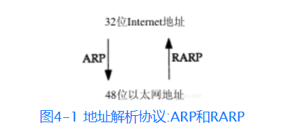

## ARP协议的作用
网络接口有一个硬件地址（一个48 bit的值，标识不同的以太网或令牌环网络接口）。在硬件层次上进行的数据帧交换必须有正确的接口地址。但是，TCP/IP有自己的地址：32 bit的IP地址。知道主机的IP地址并不能让内核发送一帧数据给主机。内核（如以太网驱动程序）必须知道目的端的硬件地址才能发送数据。ARP的功能是在32 bit的IP地址和采用不同网络技术的硬件地址之间提供动态映射。
地址解析ARP为这两种不同的地址形式提供映射：32 bit的IP32位Internet地址地址和数据链路层使用的任何类型的地址

## 流程
> % ftp bsdi
1. 应用程序FTP客户端调用函数gethostbyname(3)把主机名（bsdi）转换成32 bit的IP地址。这个函数在DNS（域名系统）中称作解析器，我们将在第14章对它进行介绍。这个转换过程或者使用DNS，或者在较小网络中使用一个静态的主机文件（/etc/hosts）。
2. FTP客户端请求TCP用得到的IP地址建立连接。
3. TCP发送一个连接请求分段到远端的主机，即用上述IP地址发送一份IP数据报（在第18章我们将讨论完成这个过程的细节）。
4. 如果目的主机在本地网络上（如以太网、令牌环网或点对点链接的另一端），那么IP数据报可以直接送到目的主机上。如果目的主机在一个远程网络上，那么就通过IP选路函数来确定位于本地网络上的下一站路由器地址，并让它转发IP数据报。在这两种情况下，IP数据报都是被送到位于本地网络上的一台主机或路由器。
5. 假定是一个以太网，那么发送端主机必须把32 bit的IP地址变换成48 bit的以太网地址。从逻辑Internet地址到对应的物理硬件地址需要进行翻译。这就是ARP的功能。ARP本来是用于广播网络的，有许多主机或路由器连在同一个网络上。
6. ARP发送一份称作ARP请求的以太网数据帧给以太网上的每个主机。这个过程称作广播，如图4-2中的虚线所示。ARP请求数据帧中包含目的主机的IP地址（主机名为bsdi），其意思是“如果你是这个IP地址的拥有者，请回答你的硬件地址。”
7. 目的主机的ARP层收到这份广播报文后，识别出这是发送端在寻问它的IP地址，于是发送一个ARP应答。这个ARP应答包含`IP地址`及对应的`硬件地址`。
8. 收到ARP应答后，使ARP进行请求—应答交换的IP数据报现在就可以传送了。
9. 发送IP数据报到目的主机。

## ARP高速缓存
ARP高效运行的关键是由于每个主机上都有一个ARP高速缓存。这个高速缓存存放了最近Internet地址到硬件地址之间的映射记录。高速缓存中每一项的生存时间一般为20分钟，起始时间从被创建时开始算起。

## ARP的分组格式
