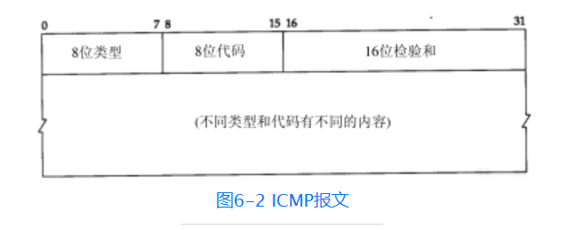
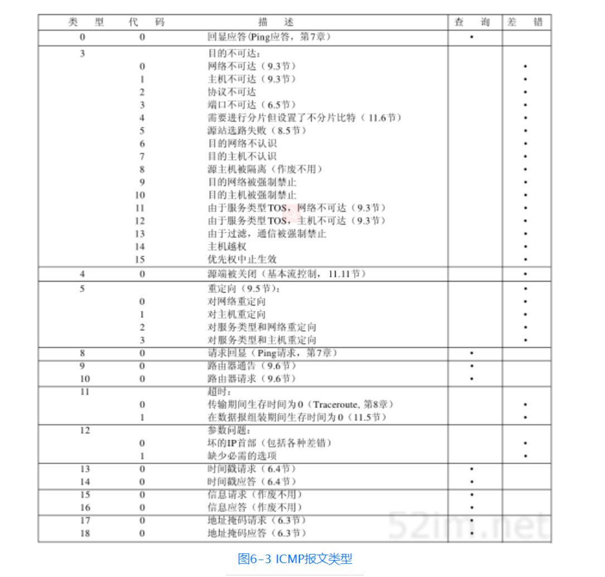

## ICMP报文作用
它传递差错报文以及其他需要注意的信息。IP 协议并不是一个可靠的协议,它不保证数据被送达,那么,自然的,保证数据送达的工作应该由其他的模块来完 成。其中一个重要的模块就是 ICMP(网络控制报文)协议。
## ICPM报文结构

当发送一份ICMP差错报文时，报文始终包含IP的首部和产生ICMP差错报文的IP数据报的前8个字节。这样，接收ICMP差错报文的模块就会把它与某个特定的协议（根据IP数据报首部中的协议字段来判断）和用户进程（根据包含在IP数据报前8个字节中的TCP或UDP报文首部中的TCP或UDP端口号来判断）联系起来。
## ICMP报文的类型

## ICMP传输
ICMP报文是在IP数据报内部被传输的

## 特殊的不产生ICMP差错报文的情况：
1. ICMP差错报文（但是，ICMP查询报文可能会产生ICMP差错报文）。
2. 目的地址是广播地址（见图3-9）或多播地址（D类地址，见图1-5）的IP数据报。
3. 作为链路层广播的数据报。
4. 不是IP分片的第一片（将在11.5节介绍分片）。
5. 源地址不是单个主机的数据报。这就是说，源地址不能为零地址、环回地址、广播地址或多播地址。
这些规则是为了防止过去允许ICMP差错报文对广播分组响应所带来的广播风暴。

## ICMP地址掩码请求与应答
ICMP地址掩码请求用于无盘系统在引导过程中获取自己的子网掩码

## ICMP时间戳请求与应答
ICMP时间戳请求允许系统向另一个系统查询当前的时间。