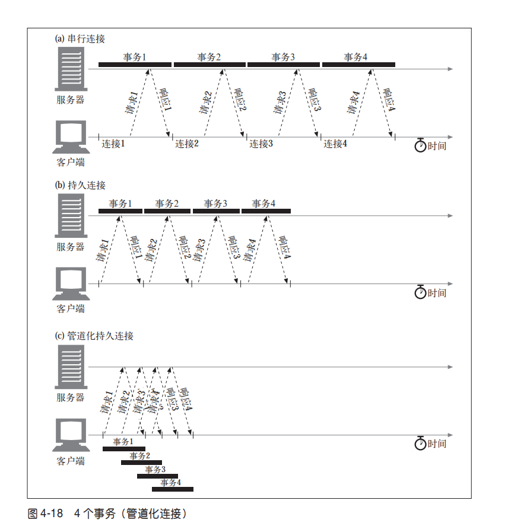

# http 超文本传输协议

# http1.0

# http1.1
• 持久化连接以支持连接重用；
• 分块传输编码以支持流式响应；
• 请求管道以支持并行请求处理；
• 字节服务以支持基于范围的资源请求；　
• 改进的更好的缓存机制。

特点：
### 并行连接
通过多条 TCP 连接发起并发的 HTTP 请求。
HTTP 允许客户端打开多条连接，并行地执行多个 HTTP 事务。在  这个例子中，并行加载了四幅嵌入式图片，每个事务都有自己的 TCP 连接。
- 打开大量连接会消耗很多内存资源，从而引发自身的性能问题。复杂的 Web 页面可能会有数十或数百个内嵌对象。客户端可能可以打开数百个连接，但 Web 服 务器通常要同时处理很多其他用户的请求，所以很少有 Web 服务器希望出现这样的 情况。一百个用户同时发出申请，每个用户打开 100 个连接，服务器就要负责处理 10 000 个连接。这会造成服务器性能的严重下降。

缺点
• 每个事务都会打开 / 关闭一条新的连接，会耗费时间和带宽。
 • 由于 TCP 慢启动特性的存在，每条新连接的性能都会有所降低。 
 • 可打开的并行连接数量实际上是有限的。

### 持久连接
重用 TCP 连接，以消除连接及关闭时延。
在事务处理结束之后仍然保持在打开状态的 TCP 连接被称为持久连接。
重用已对目标服务器打开的空闲持久连接，就可以避开缓慢的连接建立阶段。而且， 已经打开的连接还可以避免慢启动的拥塞适应阶段，以便更快速地进行数据的传输。

### 管道化连接
通过共享的 TCP 连接发起并发的 HTTP 请求
持久 HTTP 可以让我们重用已有的连接来完成多次应用请求，但多次请求必须严格
满足先进先出（FIFO）的队列顺序：发送请求，等待响应完成，再发送客户端队列
中的下一个请求。HTTP 管道是一个很小但对上述工作流却非常重要的一次优化。
管道可以让我们把 FIFO 队列从客户端（请求队列）迁移到服务器

持久连接是消除 TCP 连接时延，以及管道化请求消除传输时延的。
并行连接是通过多开tcp连接实现，管道化连接是通过持久连接tcp实现

存在问题： 
1. HTTP队首阻塞
   对于同一个tcp连接，开启管道化后，http1.1允许一次发送多个http1.1请求，也就是说，不必等前一个响应收到，就可以发送下一个请求，这样就解决了http1.0的客户端的队首阻塞。但是，http1.1规定，服务器端的响应的发送要根据 **请求被接收的顺序排队**，也就是说，先接收到的请求需要先响应回来。这样造成的问题是，如果最先收到的请求的处理时间长的话，响应生成也慢，就会阻塞已经生成了的响应的发送。也会造成队首阻塞,响应的阻塞。

- 注意：
  HTTP/2 并没有解决 TCP 的队首阻塞问题，它仅仅是通过多路复用解决了以前 HTTP1.1 管线化请求时的队首阻塞。(多次请求必须严格满足先进先出（FIFO）的队列顺序)

2. 客户端不应该以管道化方式传送非幂等请求（比如 POST）。
如果在发送出一些请求数据之后，收到返回结果之前，连 接关闭了，客户端就无法百分之百地确定服务器端实际激活了多少事务。有些事务， 比如 GET 一个静态的 HTML 页面，可以反复执行多次，也不会有什么变化。而其 他一些事务，比如向一个在线书店 POST 一张订单，就不能重复执行，不然会有下 多张订单的危险。

3. 注意tcp连接关闭

4. 如果HTTP客户端无法确认连接是持久的，就不应该使用管道。

# http2.0
HTTP 2.0 的目的就是通过支持请求与响应的多路复用来减少延迟，通过压缩 HTTP
首部字段将协议开销降至最低，同时增加对请求优先级和服务器端推送的支持。

### 对比http1.1
HTTP/1.1中所有的请求与响应均以普通文本格式(plain text format)来传输的；
HTTP/2使用二进制分帧层将http message封装为二进制格式(binary format)，同时保持所使用的HTTP语义不变

### 特点
- 所有通信都在一个 TCP 连接上完成。
- 流是连接中的一个虚拟信道，可以承载双向的消息；每个流都有一个唯一的整数
标识符（1、2…N）。
- 消息是指逻辑上的 HTTP 消息，比如请求、响应等，由一或多个帧组成。
- 帧是最小的通信单位，承载着特定类型的数据，如 HTTP 首部、负荷，等等。

### 二进制分帧层
- 流
已建立的连接上的双向字节流。流是连接中的一个虚拟信道，可以承载双向的消息（请求消息、响应消息）；每个流都有一个唯一的整数标识符（1、2…N）
- 消息
与逻辑消息对应的完整的一系列数据帧。消息是指逻辑上的 HTTP 消息，比如请求、响应等，由一或多个帧组成。
- 帧
HTTP 2.0 通信的最小单位，每个帧包含帧首部，至少也会标识出当前帧所属的流。

每个数据流以消息的形式发送，而消息由一或多个帧组成，这些帧可
以乱序发送，然后再根据每个帧首部的流标识符重新组装。

HTTP 2.0 的所有帧都采用二进制编码，所有首部数据都会被压缩。

把 HTTP 消息分解为独立的帧，交错发送，然后在另一端重新组装是 HTTP 2.0 最
重要的一项增强。

### 痛点
HTTP 2.0 的二进制分帧机制解决了 HTTP 1.x 中存在的队首阻塞问题（注意并不是tcp队首拥挤），也消
除了并行处理和发送请求及响应时对多个连接的依赖。

### 二进制分帧层优点
• 可以并行交错地发送请求，请求之间互不影响；
• 可以并行交错地发送响应，响应之间互不干扰；
• 只使用一个连接即可并行发送多个请求和响应；
• 消除不必要的延迟，从而减少页面加载的时间；
• 不必再为绕过 HTTP 1.x 限制而多做很多工作；
• 有了新的分帧机制后，HTTP 2.0 不再依赖多个 TCP 连接去实现多流并行了。现在，
每个数据流都拆分成很多帧，而这些帧可以交错，还可以分别优先级。于是，所有
HTTP 2.0 连接都是持久化的，而且客户端与服务器之间也只需要一个连接即可。
同个域名下的请求只需要占用一个 TCP 连接，请求和响应是并行执行。

### 请求优先级
每个流都可以带有一个 31 比特的优先值：
• 0 表示最高优先级；
• 231-1 表示最低优先级。

有了这个优先值，客户端和服务器就可以在处理不同的流时采取不同的策略，以最
优的方式发送流、消息和帧。具体来讲，服务器可以根据流的优先级，控制资源分
配（CPU、内存、带宽），而在响应数据准备好之后，优先将最高优先级的帧发送给
客户端。

### 服务器推送

### 首部压缩
首部的差异化编码
• HTTP 2.0 在客户端和服务器端使用“首部表”来跟踪和存储之前发送的键－值对，
对于相同的数据，不再通过每次请求和响应发送；
• 首部表在HTTP 2.0的连接存续期内始终存在，由客户端和服务器共同渐进地更新; 
• 每个新的首部键－值对要么被追加到当前表的末尾，要么替换表中之前的值。

### 升级http2.0的途径
• 通过 TLS 和 ALPN 发起新的 HTTPS 连接；
• 根据之前的信息发起新的 HTTP 连接；
• 没有之前的信息而发起新的 HTTP 连接。

• 要在 TLS 之上实现 HTTP 2.0 通信，终端服务器必须支持 ALPN； 
• 尽可能在接近用户的地方终止 TLS，尽早完成（握手）；
• 如果无法支持 ALPN，那么选择 TCP 负载均衡模式（在这种情况下，应该将负载均衡器配置为 TCP 代理，即通过它
们将加密数据发送给应用服务器，让应用服务器完成 TLS+ALPN 协商。）；
• 如果无法支持 ALPN 且 TCP 负载均衡也做不到，那么就退而求其次，在非加密
信道上使用 HTTP 的 Upgrade 流，参见 12.3.9 节“有效的 HTTP 2.0 升级与发现”。

# http状态码
- 100～199——信息性状态码
- 200～299——成功状态码
- 300～399——重定向状态码
- 400～499——客户端错误状态码
- 500～599——服务器错误状态码

# 首部
### Content-Length: 报文中实体主体的字节大小
- 对文本文件进行了 gzip 压缩的话，Content-Length 首部就是 压缩后的大小，而不是原始大小。
- 能够检测出服务器崩溃而导致的报文截 尾，并对共享持久连接的多个报文进行正确分段。
- 没有content-length首部就必须使用分块编码（Transfer-Encoding首部）

### Content-MD5
- 为检测实体主体的数据是否被不经意（或不希望有）地修改，发 送方可以在生成初始的主体时，生成一个数据的校验和
- 首部发送对实体主体运行 MD5 算法的结果
- 中间代理和缓存不应当修改或 添加这个首部
- Content-MD5首部是在对内容做了所有需要的内容编码之后，还没有做任何传输编码之前，计算出 来的。

### Content-Encoding (内容编码首部)
- gzip 表明实体采用 GNU zip 编码 
- compress 表明实体采用 Unix 的文件压缩程序
- deflate 表明实体是用 zlib 的格式压缩的
- identity 表明没有对实体进行编码。当没有 Content-Encoding 首部时，就默认为这种情况

gzip、compress 以及 deflate 编码都是无损压缩算法

### Accept-Encoding (内容编码首部)
- 客户端就把自己支持的内容编码方式列表放在请求的 Accept-Encoding 首部里发出去

### Transfer-Encoding（传输编码首部）
- 告知接收方为了可靠地传输报文，已经对其进行了何种编码。

### TE（传输编码首部）
- 用在请求首部中，告知服务器可以使用哪些传输编码扩展。

### 内容编码和传输编码
- 经过内容编码的报文，只是对报文的实
体部分进行了编码。而对于经过传输编
码的报文来说，编码作用在整个报文上，
报文自身的结构发生了改变。
- HTTP 规范只定义了一种传输编码，就是分块编码。

### 分块编码
分块编码为这种困难提供了解决方案，只要允许服务器把主体逐块发送，说明每块 的大小就可以了。因为主体是动态创建的，服务器可以缓冲它的一部分，发送其大 小和相应的块，然后在主体发送完之前重复这个过程。服务器可以用大小为 0 的块 作为主体结束的信号，这样就可以继续保持连接，为下一个响应做准备。

它由起始的 HTTP 响应首部块开始，随后就是一系列分块。每个分块包含一个长度值和该分块 的数据。长度值是十六进制形式并将 CRLF 与数据分隔开。分块中数据的大小以字 节计算，不包括长度值与数据之间的 CRLF 序列以及分块结尾的 CRLF 序列。最后 一个块有点特别，它的长度值为 0，表示“主体结束”。

### 范围请求
- Content-Type: multipart/byteranges 首部
- Range: bytes=4000- 
- Accept-Ranges:服务器可以通过在响应中 包含 Accept-Ranges 首部的形式向客户端说明可以接受的范围请求

### 差异编码
 异编码也是一类实例操控，因为它依赖客户端和服务器之间针对特定的对象实例来 交换信息。RFC 3229 描述了差异编码

- If-None-Match（请求首部）：给出服务器之前响应客户端时在 ETag 首部。
服务器必须检查它是否有这个 页面的客户端现有版本，计算客户端现有版本与最新版之间的差异（有若干算法可 以计算两个对象之间的差异）。然后服务器必须计算差异，发送给客户端，告知客户 端所发送的是差异，并说明最新版页面的新标识（ETag）
- ETag（响应首部）: 文档每个实例的唯一标识符。由服务器在响应中发送；
- A-IM（请求首部）： 客户端接受某些形式的实例操控
- IM（响应首部）： 计算差异的算法
- Delta-Base（响应首部）：用于 计算差异的基线文档的 ETag

### 国际性
- Content-Type 首 部 中 的 charset 参 数 和 Content- Language 首部告知客户端文档的字母表和语言。
- 客户端发送 Accept-Charset 首部和 Accept-Language 首部，告知服务器 它理解哪些字符集编码算法和语言以及其中的优先顺序。

### 内容协商
- 客户端驱动的协商
增加了时延：为了获得 正确的内容，至少要发 送两次请求

- 服务端驱动的协商
  1. 检查内容协商首部集。
  2. 服务器可以根据客户端发送的 User-Agent 首部来发送响应。
- 透明协商

vary 响应首部
- 这个首部告知缓存（还有客户端和所有下游的代理）服
务器根据哪些首部来决定发送响应的最佳版本。
- HTTP 响应头决定了对于后续的请求头，如何判断是请求一个新的资源还是使用缓存的文件。
当缓存服务器收到一个请求，只有当前的请求和原始（缓存）的请求头跟缓存的响应头里的Vary都匹配，才能使用缓存的响应。

# 重定向
1. http重定向
  - 需要原始服务器进行大量处理来判断要重定向到哪台服务器上去。有时，发布重 定向所需的处理量几乎与提供页面本身所需的处理量一样。 
  - 增加了用户时延，因为访问页面时要进行两次往返。 
  - 如果重定向服务器出故障，站点就会瘫痪。
2. dns重定向
3. 任播寻址
4. ip mac 转发
5. ip地址转发

