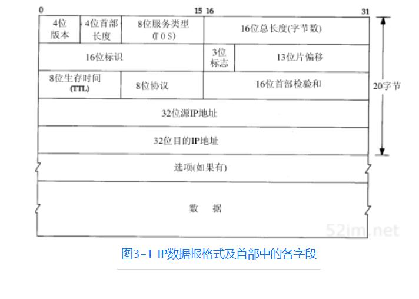
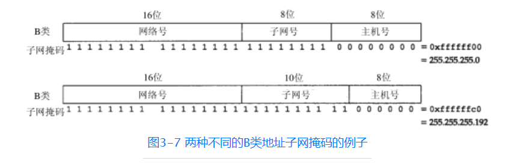

## ip首部

- 目前的协议版本号是4，因此IP有时也称作IPv4。3.10节将对一种新版的IP协议进行讨论。

- 首部长度指的是首部占32 bit字的数目，包括任何选项。由于它是一个4比特字段，因此首部最长为60个字节。在第8章中，我们将看到这种限制使某些选项如路由记录选项在当今已没有什么用处。普通IP数据报（没有任何选择项）字段的值是5。

- 服务类型（TOS）字段包括一个3bit的优先权子字段（现在已被忽略），4bit的TOS子字段和1bit未用位但必须置0。4bit的TO S分别代表：最小时延、最大吞吐量、最高可靠性和最小费用。4bit中只能置其中1bit。如果所有4bit均为0，那么就意味着是一般服务。RFC 1340[Reynolds and Postel 1992]描述了所有的标准应用如何设置这些服务类型。RFC 1349[Almquist 1992]对该RFC进行了修正，更为详细地描述了TOS的特性

- 总长度字段是指整个IP数据报的长度，以字节为单位。利用首部长度字段和总长度字段，就可以知道IP数据报中数据内容的起始位置和长度。

- 标识字段唯一地标识主机发送的每一份数据报。通常每发送一份报文它的值就会加1。

- TTL（time-to-live）生存时间字段设置了数据报可以经过的最多路由器数。它指定了数据报的生存时间

- 协议字段，根据它可以识别是哪个协议向IP传送数据。

- 首部检验和字段是根据IP首部计算的检验和码。它不对首部后面的数据进行计算。ICMP、IGMP、UDP和TCP在它们各自的首部中均含有同时覆盖首部和数据检验和码。

## ip路由选择

### 路由表
- 目的IP地址
- 下一站（或下一跳）路由器（next-hop router）的IP地址，或者有直接连接的网络IP地址。
- 标志。其中一个标志指明目的IP地址是网络地址还是主机地址
- 为数据报的传输指定一个网络接口。

IP层在内存中有一个路由表。当收到一份数据报并进行发送时，它都要对该表搜索一次。当数据报来自某个网络接口时，IP首先检查目的IP地址是否为本机的IP地址之一或者IP广播地址。如果确实是这样，数据报就被送到由IP首部协议字段所指定的协议模块进行处理。如果数据报的目的不是这些地址，那么
- （1）如果IP层被设置为路由器的功能，那么就对数据报进行转发（也就是说，像下面对待发出的数据报一样处理）；

- 否则（2）数据报被丢弃。

### IP路由选择步骤
1. 搜索路由表，寻找能与目的IP地址完全匹配的表目（网络号和主机号都要匹配）。如果找到，则把报文发送给该表目指定的下一站路由器或直接连接的网络接口（取决于标志字段的值）。
2. 搜索路由表，寻找能与目的网络号相匹配的表目。如果找到，则把报文发送给该表目指定的下一站路由器或直接连接的网络接口（取决于标志字段的值）。目的网络上的所有主机都可以通过这个表目来处置。例如，一个以太网上的所有主机都是通过这种表目进行寻径的。这种搜索网络的匹配方法必须考虑可能的子网掩码。关于这一点我们在下一节中进行讨论。
搜索路由表，寻找标为“默认（default）”的表目。如果找到，则把报文发送给该表目指定的下一站路由器。如果上面这些步骤都没有成功，那么该数据报就不能被传送。

## 子网寻址
IP 地址的定义是网络号+主机号。但是现在所有的主机都要求子网编址,也就是说,把主机号在细分成子网号+主机号。最终一个IP 地址就成为 网络号码+子网号+主机号。

## 子网掩码
根据子网掩码就可知道子网号与主机号之间的分界线。

