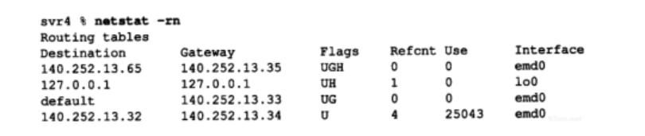

## 选路的原理

### IP搜索路由表的几个步骤
1. 搜索匹配的主机地址；
2. 搜索匹配的网络地址；
3. 搜索默认表项

### 简单路由表

- U 该路由可以使用。
- G 该路由是到一个网关（路由器）。如果没有设置该标志，说明目的地是直接相连的。
- H 该路由是到一个主机，也就是说，目的地址是一个完整的主机地址。如果没有设置该标志，说明该路由是到一个网络，而目的地址是一个网络地址：一个网络号，或者网络号与子网号的组合。
- D 该路由是由重定向报文创建的（9.5节）。
- M 该路由已被重定向报文修改（9.5节）。