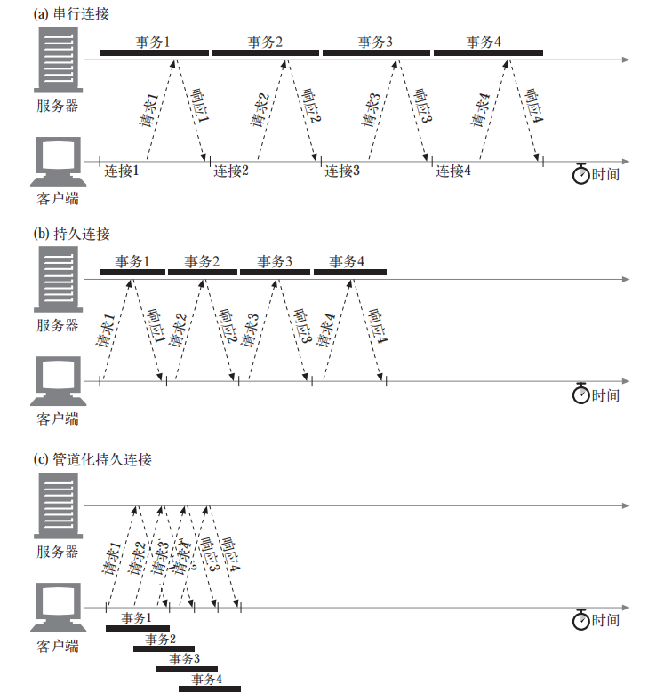

# http
### 并行连接
HTTP 允许客户端打开多条连接，并行地执行多个 HTTP 事务。在  这个例子中，并行加载了四幅嵌入式图片，每个事务都有自己的 TCP 连接。
- 打开大量连接会消耗很多内存资源，从而引发自身的性能问题。复杂的 Web 页面可能会有数十或数百个内嵌对象。客户端可能可以打开数百个连接，但 Web 服 务器通常要同时处理很多其他用户的请求，所以很少有 Web 服务器希望出现这样的 情况。一百个用户同时发出申请，每个用户打开 100 个连接，服务器就要负责处理 10 000 个连接。这会造成服务器性能的严重下降。

### 持久连接
在事务处理结束之后仍然保持在打开状态的 TCP 连接被称为持久连接。

### 管道化连接
在响应到达之前，可以将多条请求放入队列。当第一条请求通过网   流向地球另一端的服务器时，第二条和第三条请求也可以开始发送了。在高时延网  络条件下，这样做可以降低网络的环回时间，提高性能
HTTP/1.1允许多个http请求通过一个套接字同时被输出 ，而不用等待相应的响应。然后请求者就会等待各自的响应，这些响应是按照之前请求的顺序依次到达。
