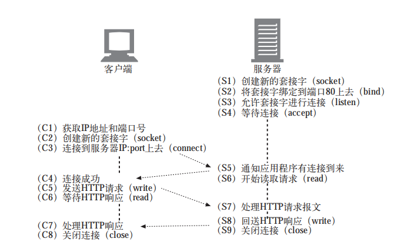

# tcp (传输控制协议) ip(因特网协议)
### tcp协议特点
 TCP 的可靠性，是建立在「每一个数据报文都需要确认收到」的基础之上的。

就是说，通讯的任何一方在收到对方的一个报文之后，都要发送一个相对应的「确认报文」，来表达确认收到。
### TCP的可靠数据管道
### TCP流是分段的、由IP分组传送 

### TCP 连接建立握手； 
### 流量控制； 
流量控制是一种预防发送端过多向接收端发送数据的机制。否则，接收端可能因为
忙碌、负载重或缓冲区既定而无法处理。为实现流量控制，TCP 连接的每一方都要
通告（图 2-2）自己的接收窗口（rwnd），其中包含能够保存数据的缓冲区空间大小
信息。
rwnd: 流量控制窗口，设定发送端到接收端窗口的最大值。
### TCP 慢启动； 
发送端和接收端在连接建立之初，谁也不知
道可用带宽是多少，因此需要一个估算机制，然后还要根据网络中不断变化的条件
而动态改变速度。

cwnd: 拥塞控制窗口， 发送端从客户端接收确认ACK之前可以发送数据量的限制

慢启动，即在分组被确认后增大窗口大小，慢慢地启动！

把服务器的初始 cwnd 值增大到 RFC 6928 新规定的 10 段（IW10），是提升用户体
验以及所有 TCP 应用性能的最简单方式。

### 拥挤预防
慢启动以保守的窗口初始化连接，随后的
每次往返都会成倍提高传输的数据量，直到超过接收端的流量控制窗口，即系统
配置的拥塞阈值（ssthresh）窗口，或者有分组丢失为止，此时拥塞预防算法介入

拥塞预防算法把丢包作为网络拥塞的标志，即路径中某个连接或路由器已经拥堵了，
以至于必须采取删包措施。因此，必须调整窗口大小，以避免造成更多的包丢失，
从而保证网络畅通
PRR（Proportional Rate Reduction，比例降速）就是 RFC 6937 规定的一个新算法，
其目标就是改进丢包后的恢复速度。

发送端和接收端之间在途未确认的最大数据量，取决于拥塞窗
口（cwnd）和接收窗口（rwnd）的最小值。接收窗口会随每次 ACK 一起发送，而
拥塞窗口则由发送端根据拥塞控制和预防算法动态调整

### 带宽延迟积
BDP（Bandwidth-delay product，带宽延迟积）
数据链路的容量与其端到端延迟的乘积。这个结果就是任意时刻处于在途未确认
状态的最大数据量。

### 队首阻塞
每个 TCP 分组都会带着一个唯一的序列号被发出，而
所有分组必须按顺序传送到接收端（图 2-8）。如果中途有一个分组没能到达接收
端，那么后续分组必须保存在接收端的 TCP 缓冲区，等待丢失的分组重发并到达接
收端。这一切都发生在 TCP 层，应用程序对 TCP 重发和缓冲区中排队的分组一无所
知，必须等待分组全部到达才能访问数据。在此之前，应用程序只能在通过套接字
读数据时感觉到延迟交付。这种效应称为 TCP 的队首（HOL，Head of Line）阻塞。

### tcp核心原理：
• TCP 三次握手增加了整整一次往返时间；
• TCP 慢启动将被应用到每个新连接；
• TCP 流量及拥塞控制会影响所有连接的吞吐量；
• TCP 的吞吐量由当前拥塞窗口大小控制

### 数据聚集的 Nagle 算法； 
### 用于捎带确认的 TCP 延迟确认算法； 
### TIME_WAIT 时延和端口耗尽。

### tcp的性能优化经验
• 把服务器内核升级到最新版本（Linux：3.2+）；
• 确保 cwnd 大小为 10； • 禁用空闲后的慢启动；
• 确保启动窗口缩放；
• 减少传输冗余数据；
• 压缩要传输的数据；
• 把服务器放到离用户近的地方以减少往返时间；
• 尽最大可能重用已经建立的 TCP 连接。