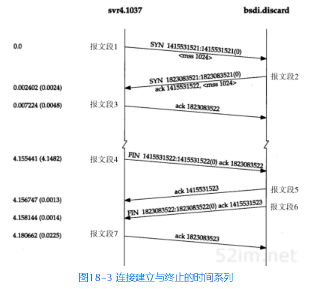

# tcp (传输控制协议)
## tcp提供了
• 无差错的数据传输； 

• 按序传输（数据总是会按照发送的顺序到达）；

• 未分段的数据流（可以在任意时刻以任意尺寸将数据发送出去）。

## tcp连接

• TCP的可靠数据管道；

• TCP流是分段的、由IP分组传送。
TCP 的数据是通过名为 IP 分组（或 IP 数据报）的小数据块来发送的。

• TCP 连接是通过 4 个值来识别的： < 源 IP 地址、源端口号、目的 IP 地址、目的端口号 >
IP 首部包含了源和目的 IP 地址、长度和其他一些标记。TCP 段的首部包含了 TCP 端口号、TCP 控制标记，以及用于数据排序和完整性检查的一些数字值。IP 地址可以将你连接到正确的计算机， 而端口号则可以将你连接到正确的应用程序上去。

• 套接字（socket）接口
套接字（socket）是通信的基石，是支持TCP/IP协议的网络通信的基本操作单元。
套接字 API 允许用户创建 TCP 的端点数据结构，将这些端点与远程服务器的 TCP 端点进行连接，并对数据流进行读写。

### 连接队列
三次握手前，服务端的状态从CLOSED变为LISTEN, 同时在内部创建了两个队列：半连接队列和全连接队列，即SYN队列和ACCEPT队列。

半连接队列
当客户端发送SYN到服务端，服务端收到以后回复ACK和SYN，状态由LISTEN变为SYN_RCVD，此时这个连接就被推入了SYN队列，也就是半连接队列。

全连接队列
当客户端返回ACK, 服务端接收后，三次握手完成。这个时候连接等待被具体的应用取走，在被取走之前，它会被推入另外一个 TCP 维护的队列，也就是全连接队列(Accept Queue)。

#### SYN Flood 攻击原理
SYN Flood 属于典型的 DoS/DDoS 攻击。其攻击的原理很简单，就是用客户端在短时间内伪造大量不存在的 IP 地址，并向服务端疯狂发送SYN。对于服务端而言，会产生两个危险的后果:

1. 处理大量的SYN包并返回对应ACK, 势必有大量连接处于SYN_RCVD状态，从而占满整个半连接队列，无法处理正常的请求。

2. 由于是不存在的 IP，服务端长时间收不到客户端的ACK，会导致服务端不断重发数据，直到耗尽服务端的资源。

#### 如何应对 SYN Flood 攻击？

增加 SYN 连接，也就是增加半连接队列的容量。
减少 SYN + ACK 重试次数，避免大量的超时重发。
利用 SYN Cookie 技术，在服务端接收到SYN后不立即分配连接资源，而是根据这个SYN计算出一个Cookie，连同第二次握手回复给客户端，在客户端回复ACK的时候带上这个Cookie值，服务端验证 Cookie 合法之后才分配连接资源。

### 数据聚集的 Nagle 算法； 
Nagle算法就是为了尽可能发送大块数据，避免网络中充斥着许多小数据块。（减少大量小包的发送）
Nagle算法的基本定义是任意时刻，最多只能有一个未被确认的小段。所谓“小段”，指的是小于MSS尺寸的数据块，所谓“未被确认”，是指一个数据块发送出去后，没有收到对方发送的ACK确认该数据已收到。

### 用于捎带确认的延迟确认算法（延迟ACK）；
与Nagle算法一样，延迟ACK的目的也是为了减少网络中传输大量的小报文数，但该报文数是针对ACK报文的。 
一个来自发送端的报文到达接收端，TCP会延迟ACK的发送，希望应用程序会对刚刚收到的数据进行应答，这样就可以用新数据将ACK捎带过去。
TCP 允许在发往相同方向的输出数据分组中对其进行“捎 带”。TCP 将返回的确认信息与输出的数据分组结合在一起，可以更有效地利用网 络。为了增加确认报文找到同向传输数据分组的可能性，很多 TCP 栈都实现了一种“延迟确认”算法。延迟确认算法会在一个特定的窗口时间（通常是 100 ～ 200 毫 秒）内将输出确认存放在缓冲区中，以寻找能够捎带它的输出数据分组。如果在那 个时间段内没有输出数据分组，就将确认信息放在单独的分组中传送。 但是，HTTP 具有双峰特征的请求 - 应答行为降低了捎带信息的可能。当希望有相 反方向回传分组的时候，偏偏没有那么多。通常，延迟确认算法会引入相当大的时 延。根据所使用操作系统的不同，可以调整或禁止延迟确认算法。

### TIME_WAIT累积与端口耗尽
当某个 TCP 端点关闭 TCP 连接时，会在内存中维护一个小的控制块，用来记录最 近所关闭连接的 IP 地址和端口号。这类信息只会维持一小段时间，通常是所估计的 最大分段使用期的两倍（称为 2MSL，通常为 2 分钟 8）左右，以确保在这段时间内 不会创建具有相同地址和端口号的新连接。

在只有一个客户端和一台 Web 服务器的异常情况下，构建一条 TCP 连接的 4 个值： 
<source-IP-address, source-port, destination-IP-address, destination-port> 
其中的 3 个都是固定的——只有源端口号可以随意改变： 
<client-IP, source-port, server-IP, 80> 
客户端每次连接到服务器上去时，都会获得一个新的源端口，以实现连接的唯一性。 但由于可用源端口的数量有限（比如，60 000 个），而且在 2MSL 秒（比如，120 秒）内连接是无法重用的，连接率就被限制在了 60 000/120=500 次 / 秒。

### 流量控制； 
流量控制是一种预防发送端过多向接收端发送数据的机制。否则，接收端可能因为
忙碌、负载重或缓冲区既定而无法处理。为实现流量控制，TCP 连接的每一方都要
通告自己的接收窗口（rwnd），其中包含能够保存数据的缓冲区空间大小
信息。
rwnd: 流量控制窗口，设定发送端到接收端窗口的最大值。接收端给的限制

### TCP 慢启动； 
慢启动，即在分组被确认后增大窗口大小，慢慢地启动！TCP 连接会随着时间进行 自我“调谐”，起初会限制连接的最大速度，如果数据成功传输，会随着时间的推移 提高传输的速度。这种调谐被称为 TCP 慢启动（slow start），用于防止因特网的突 然过载和拥塞。

cwnd: 拥塞控制窗口， 发送端从客户端接收确认ACK之前可以发送数据量的限制。发送端的限制，发送窗口大小 = min(rwnd, cwnd)

把服务器的初始 cwnd 值增大到 RFC 6928 新规定的 10 段（IW10），是提升用户体
验以及所有 TCP 应用性能的最简单方式。

### 拥挤预防
慢启动以保守的窗口初始化连接，随后的
每次往返都会成倍提高传输的数据量，直到超过接收端的流量控制窗口，即系统
配置的拥塞阈值（ssthresh）窗口，或者有分组丢失为止，此时拥塞预防算法介入

拥塞预防算法把丢包作为网络拥塞的标志，即路径中某个连接或路由器已经拥堵了，
以至于必须采取删包措施。因此，必须调拥挤整窗口大小，以避免造成更多的包丢失，
从而保证网络畅通
PRR（Proportional Rate Reduction，比例降速）就是 RFC 6937 规定的一个新算法，
其目标就是改进丢包后的恢复速度。

发送端和接收端之间在途未确认的最大数据量，取决于拥塞窗
口（cwnd）和接收窗口（rwnd）的最小值。接收窗口会随每次 ACK 一起发送，而
拥塞窗口则由发送端根据拥塞控制和预防算法动态调整

### 带宽延迟积
BDP（Bandwidth-delay product，带宽延迟积）
数据链路的容量与其端到端延迟的乘积。这个结果就是任意时刻处于在途未确认
状态的最大数据量。

### 队首阻塞
每个 TCP 分组都会带着一个唯一的序列号被发出，而
所有分组必须按顺序传送到接收端。如果中途有一个分组没能到达接收
端，那么后续分组必须保存在接收端的 TCP 缓冲区，等待丢失的分组重发并到达接
收端。这一切都发生在 TCP 层，应用程序对 TCP 重发和缓冲区中排队的分组一无所
知，必须等待分组全部到达才能访问数据。在此之前，应用程序只能在通过套接字
读数据时感觉到延迟交付。这种效应称为 TCP 的队首（HOL，Head of Line）阻塞。

### 超时重传
TCP 的可靠性，是建立在「每一个数据报文都需要确认收到」的基础之上的。
就是说，通讯的任何一方在收到对方的一个报文之后，都要发送一个相对应的「确认报文」，来表达确认收到。
每个 TCP 段都有一个序列号和数据完整性校验和。每个段的接收者收到完好的段 时，都会向发送者回送小的确认分组。如果发送者没有在指定的窗口时间内收到确 认信息，发送者就认为分组已被破坏或损毁，并重发数据。
在进行TCP传输时，由于确认应答与序列号机制，也就是说发送方发送一部分数据后，都会等待接收方发送的ACK报文，并解析ACK报文，判断数据是否传输成功。如果发送方发送完数据后，迟迟没有等到接收方的ACK报文，这该怎么办呢？而没有收到ACK报文的原因可能是什么呢？

1. 数据在传输过程中由于网络原因等直接全体丢包，接收方根本没有接收到。
2. 接收方接收到了响应的数据，但是发送的ACK报文响应却由于网络原因丢包了。

TCP在解决这个问题的时候引入了一个新的机制，叫做超时重传机制。简单理解就是发送方在发送完数据后等待一个时间，时间到达没有接收到ACK报文，那么对刚才发送的数据进行重新发送。如果是刚才第一个原因，接收方收到二次重发的数据后，便进行ACK应答。如果是第二个原因，接收方发现接收的数据已存在（判断存在的根据就是序列号，所以上面说序列号还有去除重复数据的作用），那么直接丢弃，仍旧发送ACK应答。

那么发送方发送完毕后等待的时间是多少呢？如果这个等待的时间过长，那么会影响TCP传输的整体效率，如果等待时间过短，又会导致频繁的发送重复的包。如何权衡？

由于TCP传输时保证能够在任何环境下都有一个高性能的通信，因此这个最大超时时间（也就是等待的时间）是动态计算的。

## tcp核心原理：
- TCP 三次握手增加了整整一次往返时间；
- TCP 慢启动将被应用到每个新连接；
- TCP 流量及拥塞控制会影响所有连接的吞吐量；
- TCP 的吞吐量由当前拥塞窗口大小控制

## tcp的性能优化经验
- 把服务器内核升级到最新版本（Linux：3.2+）；
- 确保 cwnd 大小为 10； 
- 禁用空闲后的慢启动；
- 确保启动窗口缩放；
- 减少传输冗余数据；
- 压缩要传输的数据；
- 把服务器放到离用户近的地方以减少往返时间；
- 尽最大可能重用已经建立的 TCP 连接。

## tcp三次握手过程

### tcp为什么需要三次握手？
1. **为了防止已失效的连接请求报文段突然又传送到了服务端，因而产生错误**
已失效的连接请求报文段”的产生在这样一种情况下：
client发出的第一个连接请求报文段并没有丢失，而是在某个网络结点长时间的滞留了，以致延误到连接释放以后的某个时间才到达server。本来这是一个早已失效的报文段。但server收到此失效的连接请求报文段后，就误认为是client再次发出的一个新的连接请求。于是就向client发出确认报文段，同意建立连接。假设不采用“三次握手”，那么只要server发出确认，新的连接就建立了。由于现在client并没有发出建立连接的请求，因此不会理睬server的确认，也不会向server发送数据。但server却以为新的运输连接已经建立，并一直等待client发来数据。这样，server的很多资源就白白浪费掉了。
2. 需要三次握手来约定确定双方的 ISN（初始 seq 序列号）。

## tcp四次挥手过程

### tcp为什么需要四次挥手？
本质的原因是tcp是全双公的，要实现可靠的连接关闭，A发出结束报文FIN，收到B确认后A知道自己没有数据需要发送了，B知道A不再发送数据了，自己也不会接收数据了，但是此时A还是可以接收数据，B也可以发送数据；当B发出FIN报文的时候此时两边才会真正的断开连接。