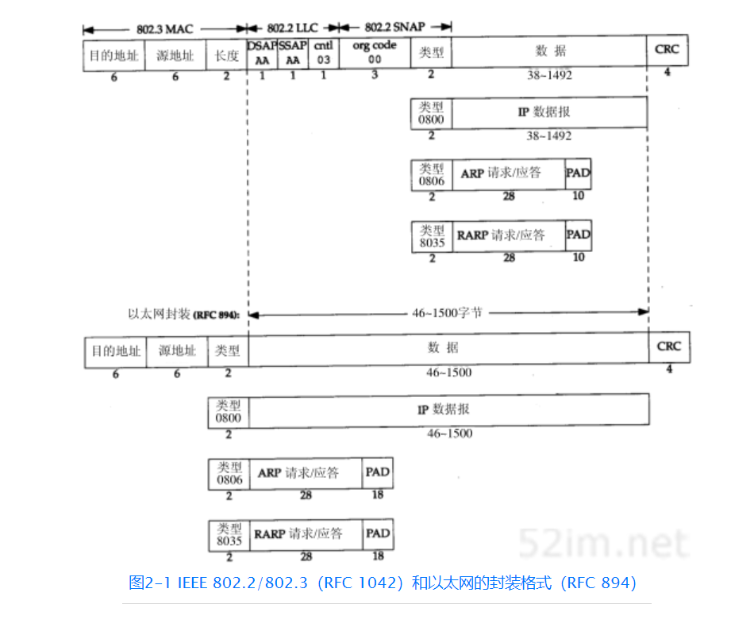
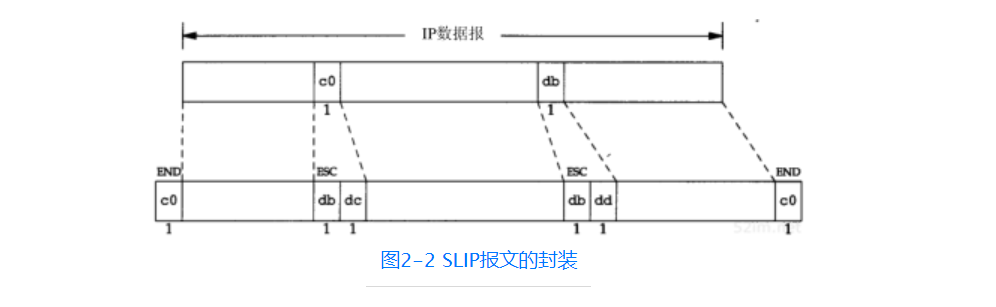

### 链路层三个目的：
（1）为IP模块发送和接收IP数据报；
（2）为ARP模块发送ARP请求和接收ARP应答；
（3）为RARP发送RARP请求和接收RARP应答。

## 以太网
它是当今TCP/IP采用的主要的局域网技术
### 以太网和IEEE 802帧封装

## SLIP：串行线路IP
它是一种在串行线路上对IP数据(帧)报进行封装的简单形式，.SLIP适用于家庭中每台计算机几乎都有的RS-232串行端口和高速调制解调器接入Internet。

### SLIP报文的封装

### SLIP缺点
1. 每一端必须知道对方的IP地址。没有办法把本端的IP地址通知给另一端。
2. 数据帧中没有类型字段（类似于以太网中的类型字段）。如果一条串行线路用于SLIP，那么它不能同时使用其他协议。
3. SLIP没有在数据帧中加上检验和（类似于以太网中的CRC字段）。如果SLIP传输的报文被线路噪声影响而发生错误，只能通过上层协议来发现（另一种方法是，新型的调制解调器可以检测并纠正错误报文）。这样，上层协议提供某种形式的CRC就显得很重要。

## CSLIP 压缩的SLIP
SLIP线路上有许多小的TCP分组进行交换。为了传送1个字节的数据需要20个字节的IP首部和20个字节的TCP首部，总数超过40个字节。
人们提出一个被称作CSLIP（即压缩SLIP）的新协议。CSLIP一般能把上面的40个字节压缩到3或5个字节。它能在CSLIP的每一端维持多达16个TCP连接，并且知道其中每个连接的首部中的某些字段一般不会发生变化

### PPP：点对点协议
PPP，点对点协议修改了SLIP协议中的所有缺陷。PPP包括以下三个部分：

1. 在串行链路上封装IP数据报的方法。PPP既支持数据为8位和无奇偶检验的异步模式（如大多数计算机上都普遍存在的串行接口），还支持面向比特的同步链接。
2. 建立、配置及测试数据链路的链路控制协议（LCP：Link Control Protocol）。它允许通信双方进行协商，以确定不同的选项。
3. 针对不同网络层协议的网络控制协议（NCP：Network Control Protocol）体系。当前RFC定义的网络层有IP、OSI网络层、DECnet以及AppleTalk。例如，IP NCP允许双方商定是否对报文首部进行压缩，类似于CSLIP（缩写词NCP也可用在TCP的前面）。

## 链路层最大传输单元MTU
以太网和802.3对数据帧的长度都有一个限制，其最大值分别是1500和1492字节。链路层的这个特性称作MTU ,最大传输单元。
IP层有一个数据报要传，而且数据的长度比链路层的MTU还大,那么IP层就需要进行分片
它是一个逻辑限制，目的是为交互使用提供足够快的响应时间。

### 路径MTU
在同一个网络上的两台主机互相进行通信时，该网络的MTU是非常重要的。但是如果两台主机之间的通信要通过多个网络，那么每个网络的链路层就可能有不同的MTU。重要的不是两台主机所在网络的MTU的值，重要的是两台通信主机路径中的最小MTU。它被称作路径MTU。
两台主机之间的路径MTU不一定是个常数。它取决于当时所选择的路由。而选路不一定是对称的（从A到B的路由可能与从B到A的路由不同），因此路径MTU在两个方向上不一定是一致的。