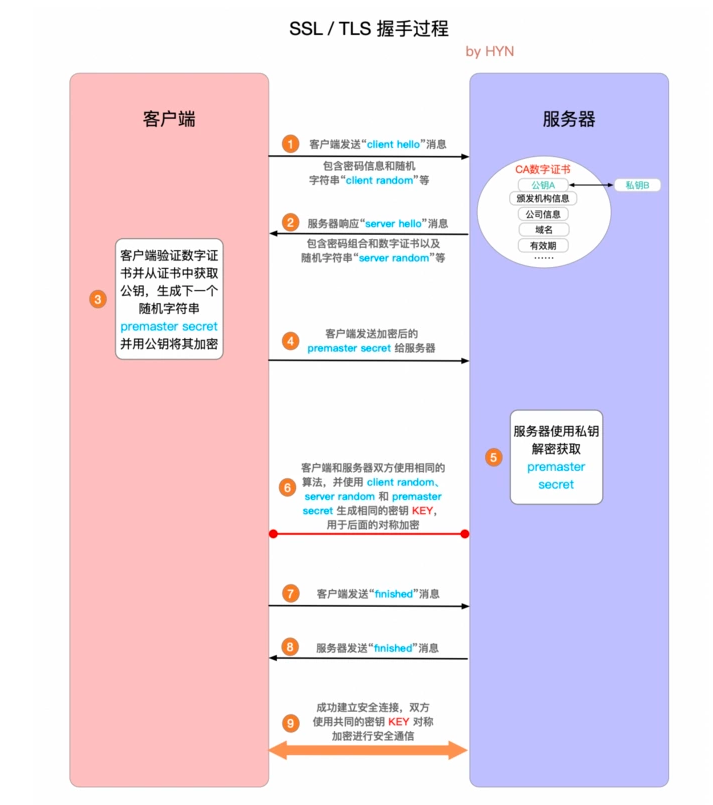

# tls协议
- IETF 后来在标准化 SSL 协议时，将其改名为 Transport Layer Security
（TLS，传输层安全）。很多人会混用 TLS 和 SSL，但严格来讲它们并不相
同，因为它们指代的协议版本不同。

TLS 协议的目标是为在它之上运行的应用提供三个基本服务：加密、身份验证和数
据完整性。

- 加密
混淆数据的机制
- 身份验证
验证身份标识有效性的机制CA
- 完整性
检测消息是否被篡改或伪造的机制MAC

TLS/SSL 的功能实现主要依赖于三类基本算法：散列函数 Hash、对称加密和非对称加密，其利用非对称加密实现身份认证和密钥协商，对称加密算法采用协商的密钥对数据加密，基于散列函数验证信息的完整性。
在 HTTPS 协议中，客户端发出请求，服务端会将公钥发给客户端，客户端验证过后生成一个密钥再用公钥加密后发送给服务端（非对称加密），双方会在 TLS 握手过程中生成一个协商密钥（对称密钥），成功后建立加密连接。通信过程中客户端将请求数据用协商密钥加密后发送，服务端也用协商密钥解密，响应也用相同的协商密钥。后续的通信使用对称加密是因为对称加解密快，而握手过程中非对称加密可以保证加密的有效性，但是过程复杂，计算量相对来说也大。

- 对称加密
对称加密 很好理解，就是指加密和解密时使用的密钥都是同一个
TLS 里有非常多的对称加密算法可供选择，目前常用的有 AES-128、AES-192、AES-256 和 ChaCha20。

- 非对称加密
它有两个密钥，一个叫 公钥（public key），一个叫 私钥（private key）。两个密钥是不同的，不对称，公钥可以公开给任何人使用，而私钥必须严格保密。
公钥和私钥有个特别的 单向 性，虽然都可以用来加密解密，但公钥加密后只能用私钥解密，反过来，私钥加密后也只能用公钥解密。
非对称加密可以解决 密钥交换 的问题。网站秘密保管私钥，在网上任意分发公钥，你想要登录网站只要用公钥加密就行了，密文只能由私钥持有者才能解密。而黑客因为没有私钥，所以就无法破解密文。
非对称加密算法的设计要比对称算法难得多，在 TLS 里只有很少的几种，比如 DH、DSA、RSA、ECC 等。

### tls的加密流程
 TLS 里使用的 混合加密 方式，其实说穿了也很简单：
在通信刚开始的时候使用非对称算法，比如 RSA、ECDHE，首先解决密钥交换的问题。

然后用随机数产生对称算法使用的 会话密钥（session key），再用公钥加密。因为会话密钥很短，通常只有 16 字节或 32 字节，所以慢一点也无所谓。

对方拿到密文后用私钥解密，取出会话密钥。这样，双方就实现了对称密钥的安全交换，后续就不再使用非对称加密，全都使用对称加密。
 
• 0 ms：TLS 在可靠的传输层（TCP）之上运行，这意味着首先必须完成 TCP 的“三
次握手”，即一次完整的往返。
• 56 ms：TCP 连接建立之后，客户端再以纯文本形式发送一些规格说明，比如它所运
行的 TLS 协议的版本、它所支持的加密套件列表，以及它支持或希望使用的另外一
些 TLS 选项。
• 84 ms：然后，服务器取得 TLS 协议版本以备将来通信使用，从客户端提供的加密
套件列表中选择一个，再附上自己的证书，将响应发送回客户端。作为可选项，服
务器也可以发送一个请求，要求客户端提供证书以及其他 TLS 扩展参数。
• 112 ms：假设两端经过协商确定了共同的版本和加密套件，客户端也高高兴兴地
把自己的证书提供给了服务器。然后，客户端会生成一个新的对称密钥，用服务
器的公钥来加密，加密后发送给服务器，告诉服务器可以开始加密通信了。到
目前为止，除了用服务器公钥加密的新对称密钥之外，所有数据都以明文形式
发送。
• 140 ms：最后，服务器解密出客户端发来的对称密钥，通过验证消息的 MAC 检
测消息完整性，再返回给客户端一个加密的“Finished”消息。
• 168 ms：客户端用它之前生成的对称密钥解密这条消息，验证 MAC，如果一切
顺利，则建立信道并开始发送应用数据。

### TLS 握手详细过程

1. "client hello"消息：客户端通过发送"client hello"消息向服务器发起握手请求，该消息包含了客户端所支持的 TLS 版本和密码组合以供服务器进行选择，还有一个"client random"随机字符串。
2. "server hello"消息：服务器发送"server hello"消息对客户端进行回应，该消息包含了数字证书，服务器选择的密码组合和"server random"随机字符串。
3. 验证：客户端对服务器发来的证书进行验证，确保对方的合法身份，验证过程可以细化为以下几个步骤：
- 检查数字签名
- 验证证书链 (这个概念下面会进行说明)
- 检查证书的有效期
- 检查证书的撤回状态 (撤回代表证书已失效)
4. "premaster secret"字符串：客户端向服务器发送另一个随机字符串"premaster secret (预主密钥)"，这个字符串是经过服务器的公钥加密过的，只有对应的私钥才能解密。
5. 使用私钥：服务器使用私钥解密"premaster secret"。
6. 生成共享密钥：客户端和服务器均使用 client random，server random 和 premaster secret，并通过相同的算法生成相同的共享密钥 KEY。
7. 客户端就绪：客户端发送经过共享密钥 KEY加密过的"finished"信号。
8. 服务器就绪：服务器发送经过共享密钥 KEY加密过的"finished"信号。
9. 达成安全通信：握手完成，双方使用对称加密进行安全通信。

### 信任链与证书颁发机构
它就像网络世界里的公安局、教育部、公证中心，具有极高的可信度，由它来给各个公钥签名，用自身的信誉来保证公钥无法伪造，是可信的。

### tls构成
- 记录协议接收应用数据。
- 接收到的数据被切分为块：最大为每条记录 214 字节，即 16 KB。 
- 压缩应用数据（可选）。
- 添加 MAC（Message Authentication Code）或 HMAC。 
- 使用商定的加密套件加密数据。
