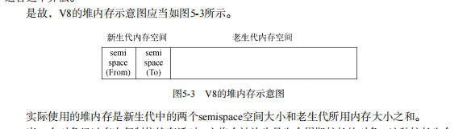

V8的垃圾回收策略主要基于分代式垃圾回收机制（新生代和老生代）

V8的内存分代
1. 新生代：存活时间较短的对象
2. 老生代： 存活时间较长或常驻内存的对象

## 新生代中的对象主要通过Scavenge算法进行垃圾回收，Scavenge主要采用了Cheney算法
Cheney算法将堆内存一分为二，一个处于使用中，另一个处于闲置状态，使用中的交From空间，闲置状态的叫To空间。

算法流程：
1. 当我们分配对象时，先在From空间中分配
2. 当进行垃圾回收时，会检查From空间中存货的对象，然后将存货对象复制到To空间，而非存活对象占用的空间将被释放。
3. 完成复制后，From空间和To空间角色互换。
4. 当一个对象经过多次复制依然存活时，他将被认为是生命周期较长的对象，随后会被移动到老生代中，使用新的算法进行管理

新生代内存中对象晋升老生代内存的条件：
1. 是否经历过Scavenge回收
2. To空间内存占用超过限制

## 老生代垃圾回收算法 Mark-Sweep & Mark-Compact
###  Mark-Sweep 标记清除 （加强版引用计数）
标记清除算法，分为两部分，标记，清除。

算法流程：
1. 标记阶段，遍历堆中所有对象，然后标记活着的对象
   1. 垃圾收集器在运行时会给内存中的所有变量都加上一个标记，假设内存中所有对象都是垃圾，全标记为0
   2. 然后从各个根对象开始遍历，把不是垃圾的节点改成1
2. 清除阶段，清除没有标记到的对象。
   1. 清理所有标记为0的垃圾，销毁并回收它们所占用的内存空间
   2. 最后，把所有内存中对象标记修改 
   3. 等待下一轮垃圾回收

存在问题：
在进行一次清除回收后，内存空间不连续。
方案：
Mark-Compact(标记整理)算法，他们的差别在于对象在标记死亡后，在整理的过程中，活着的对象往一端移动，移动完成后清理掉边界外的内存。

V8的回收策略中，Mark-Sweep和Mark-Compact策略是结合使用的。

### Mark-Compact 标记整理
在整理的过程中，会将活动的对象往堆内存的一端进行移动，移动完成后再清理掉边界外的全部内存

### 全停顿和增量标记