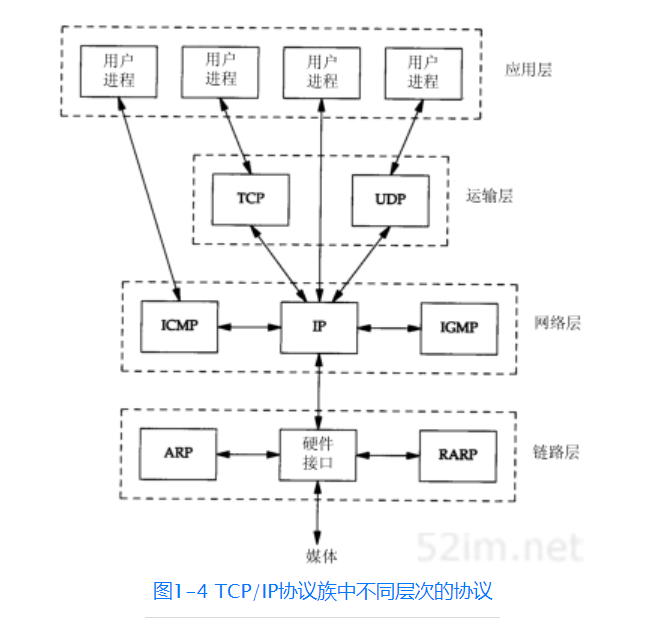

- OSI体系结构: 概念清楚，理论也比较完整，但是它既复杂又不实用。
- TCP/IP协议族:TCP/IP是一个四层体系结构，得到了广泛的运用。
- 五层体系结构:为了方便学习，折中OSI体系结构和TCP/IP体系结构，综合二者的优点，这样既简洁，又能将概念讲清楚。

## OSI体系结构（七层）
- 应用层
应用层（Application Layer）提供为应用软件而设计的接口，以设置与另一应用软件之间的通信。例如：HTTP、HTTPS、FTP、Telnet、SSH、SMTP、POP3等。

- 表示层
表示层（Presentation Layer）把数据转换为能与接收者的系统格式兼容并适合传输的格式。

- 会话层
会话层（Session Layer）负责在数据传输中设置和维护计算机网络中两台计算机之间的通信连接。

- 传输层
传输层（Transport Layer）把传输表头（TH）加至数据以形成数据包。传输表头包含了所使用的协议等发送信息。例如:传输控制协议（TCP）等。
  1. TCP（传输控制协议）
  2. UDP（用户数据报协议）

- 网络层
网络层（Network Layer）决定数据的路径选择和转寄，将网络表头（NH）加至数据包，以形成分组。网络表头包含了网络资料。例如:互联网协议（IP）等。
  1. IP协议（网际协议）
  2. ICMP协议（互联网控制报文协议）
  3. IGMP协议（组管理协议）

- 数据链路层
数据链路层（Data Link Layer）负责网络寻址、错误侦测和改错。当表头和表尾被加至数据包时，会形成信息框（Data Frame）。数据链表头（DLH）是包含了物理地址和错误侦测及改错的方法。数据链表尾（DLT）是一串指示数据包末端的字符串。例如以太网、无线局域网（Wi-Fi）和通用分组无线服务（GPRS）等。

分为两个子层：逻辑链路控制（logical link control，LLC）子层和介质访问控制（Media access control，MAC）子层。

- 物理层
物理层（Physical Layer）在局部局域网上传送数据帧（Data Frame），它负责管理电脑通信设备和网络媒体之间的互通。包括了针脚、电压、线缆规范、集线器、中继器、网卡、主机接口卡等。

## TCP/IP协议族（四层）
- 应用层
- 传输层
- 网络层
- 链路层/网络接口层

## 五层体系结构
- 应用层
- 传输层
- 网络层
- 数据链路层
- 物理层

