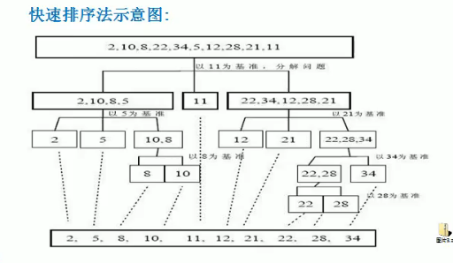

### 排序算法
#### 分类：
- 内部排序
   把需要处理的所有数据都加载到内部存储器中进行排序
   内部排序分为
   - 插入排序
      1. 直接插入排序
      2. 希尔排序
   - 选择排序
      1. 简单选择排序
      2. 堆排序
   - 交换排序
      1. 冒泡排序
      2. 快速排序
   - 归并排序
   - 基数排序
- 外部排序
   数据量过大，无法全部加载到内存中，需要借助外部存储进行排序

#### 算法的时间复杂度
- 事后统计法
   直接运行看时间
- 事前估算法
   分析时间复杂度

**时间频度**
一个算法花费的时间与算法中语句的执行次数成正比例，一个算法中语句执行次数称为语句频度或时间频度,记为T(n).


**计算时间复杂度**
算法中基本操作语句的重复执行次数是问题规模n的某个函数,用f(n)表示,若有某个辅助函数f(n),使得当n趋近于无穷大时,T(n)/f(n)的极限值为不等于零的常数,则称f(n)是T(n)的同数量级函数.记做T(n)=O(f(n)),称O(f(n))为算法的渐进时间复杂度,简称时间复杂度.
例子: T(n) = n+1  f(n) = n
n+1/n => 1 => T(n) = O(f(n)) = O(n)


也就是把时间频度
  - 忽略常数项
  - 忽略低次项
  - 忽略系数(n的三次方以上系数不忽略)

常见的时间复杂度
- 常数阶O(1)
  - 无论什么数据都执行固定条语句,就是O(1)
- 对数阶O(log2n)
  ```java
  int i = 1;
  while(i<n) {
    i = i * 2
  }
  时间复杂度 O(logan),其中a是例子里面的2
  ```
- 线性阶O(n)
  ```java
  int i = 1;
  while(i<n) {
    i++
  }
  ```
- 线形对数阶O(nlog2n)
  ```java
  for(m=1;m<n;m++) {
    i = 1;
    while(i<n) {
      i = i * 2
    }
  }

  时间复杂度 O(nlogan),其中a是例子里面的2
  将时间复杂度为logan的代码循环n遍
  ```
- 平方阶O(n^2)
  - 两个for循环
- 立方阶O(n^3)
- k次方阶O(n^k)
- 指数阶O(2^n)

#### 算法的空间复杂度
**概念**
一个算法的空间复杂度定义为改算法所耗费的存储空间,它也是问题规模n的函数.

#### 冒泡排序
#### 选择排序
##### 思想：
第一次从arr[0]-arr[n-1]中选取最小值,返入arr[0],第二次从arr[1]-arr[n-1]选最小值,放入arr[i]
1. 选择排序一共有数组大小-1轮排序(最后一位一定是最大的,不用排序了)
  
```java
// 选择排序
public static void selectSort(int[] arr) {
  for (int i = 0; i < arr.length - 1; i++) {
    int minIndex = i;
    int min = arr[i];
    for (int j = i + 1; j < arr.length; j++) {
      if (min > arr[j]) {
        min = arr[j];
        minIndex = j;
      }
    }
    if (minIndex != i) {
      arr[minIndex] = arr[i];
      arr[i] = min;
    }
  }
}
```

#### 插入排序
##### 思想：
把n个待排序的元素看成是一个有序表和一个无序表。
开始时无序表只包含一个元素，无序表n-1个元素，排序过程找那个每次从无序表中取出第一个元素，然后后在有序插入有序表，使之成为新的有序表。
```java
// 选择排序
public static void insertSort(int[] arr) {
  for (int i = 0; i < arr.length; i++) {
    // 待插入的数
    int insertVal = arr[i];
    int insertIndex = i - 1;// 默认待插入的数就是有序数组中最大的数。

    // 保证在给inserVal找插入位置时不越界
    while (insertIndex >= 0 && insertVal < arr[insertIndex]) {
      arr[insertIndex + 1] = arr[insertIndex];
      insertIndex--;
    }
    if (insertIndex + 1 != i) {
      arr[insertIndex + 1] = insertVal;
    }
  }
}

其他实现
public static void sort(arr) {
  for(int i=1;i<a.length;i++) {
    for(int j=i;j>=0;j--) {
      // 比较j与j-1的值
      if(arr[j-1]>arr[j]) {
        let temp = arr[j]
        arr[j] = arr[j-1]
        arr[j-1] = temp
      } else {
        break;
      }
    }
  }
}
// js 实现
function sort(arr) {
  for(var i=1;i<arr.length;i++) {
    for(var j=i;j>=0;j--) {
      // 比较j与j-1的值
      if(arr[j-1]>arr[j]) {
        let temp = arr[j]
        arr[j] = arr[j-1]
        arr[j-1] = temp
      } else {
        break;
      }
    }
  }
  return arr
}
sort([6,3,3,5,6,61,32,14,126,5])
```

#### 希尔排序
##### 思想：
把记录按下标的一定增量分组，随着增量的逐渐减少，当增量为1，排序完毕。
1. 选定增长量h,按照增长量h作为数据分组的依据,对数据进行分组
2. 对分好组的每一组数据完成插入排序
3. 减少增长量,最小减为1,重复第二部


```java
// 交换的希尔排序
int temp = 0;
for(int gap = arr.length / 2;gap>0;gap /=2) {
  for (int i = gap; i < arr.length; i++) {
    for (int j = i - gap; j >= 0; j -= gap) {
      if (arr[j] > arr[j + gap]) {
        temp = arr[j];
        arr[j] = arr[j + gap];
        arr[j + gap] = temp;
      }
    }
  }
}
		
// 移位的希尔排序
for(int gap = arr.length / 2;gap>0;gap /= 2) {
  for (int i = gap; i < arr.length; i++) {
    int j = i;
    int temp = arr[j];
    if(arr[j] < arr[j-gap]) {
      while(j - gap >= 0 && temp < arr[j-gap]) {
        arr[j] = arr[j-gap];
        j -= gap;
      }
      // 当退出while后，代表找到temp位置
      arr[j] = temp;
    }
  }
}

// js实现
function xier(arr) {
  let temp
  for(var gap = arr.length / 2;gap>0;gap= parseInt(gap/2)) {
    for (var i = gap; i < arr.length; i++) {
      // 对每一组分组好的数据进行插入排序
      for (var j = i - gap; j >= 0; j -= gap) {
        if (arr[j] > arr[j + gap]) {
          temp = arr[j];
          arr[j] = arr[j + gap];
          arr[j + gap] = temp;
          break;
        }
      }
    }
  }
  return arr
}
xier([1,2,4,5,6,7,1,4,562,3])
```
#### 归并排序

#### 快速排序
思想：冒泡排序的改进，找到中间数，找到比中间数小放中间数左边，找到比中间数大，放中间数右边。

```java
public static void quickSort(int[] arr, int left, int right) {
  int l = left;//最左下标
  int r = right;// 最右下标
  int pivot = arr[(left + right)/2];//中下标
  int temp = 0; //临时变量，交换时使用
  // 比pivot小的放左边
  // 比pivot大的放右边
  while(l < r) {
    // 在pivot的左边一直找，找到大于等于pivot的值才退出。
    while(arr[l] < pivot) {
      l += 1;
    }
    // 在pivot的右边一直找，找到小于等于pivot的值才退出。
    while(arr[r] > pivot) {
      r -= 1;
    }
    // 如果 l >= r 说明pivot左边全是小于等于pivot的值，右边全是大于等于pivot的值
    if(l >= r) {
      break;
    }
    // 交换
    temp = arr[l];
    arr[l] = arr[r];
    arr[r] = temp;
    
    // 如果交换完后，发现arr[l] == pivot的值 ，前移一步
    if(arr[l] == pivot) {
      r--;
    }
    if(arr[r] == pivot) {
      l++;
    }
  }
  
  if(l == r) {
    l += 1;
    r -= 1;
  }
  // 向左递归
  if(left < r) {
    quickSort(arr,left,r);
  }
  // 向右递归
  if(left > l) {
    quickSort(arr,l,right);
  }
}
```
#### 基数排序
##### 思想
- 创建十个桶0-9，从个位开始按个位大小放入对应的0-9桶然后按顺序替换到数组中然后一直循环到最大数的位数次的排序
##### 特征
- 基数排序是稳定的，记录的相对次序保持不变，同数的先后顺序不发生改变。
- 不支持负数
```java
public static void radixSort(int[] arr) {
  // 得到数组中最大的数的位数
  int max = arr[0];
  for (int i = 1; i < arr.length; i++) {
    if (arr[i] > max) {
      max = arr[i];
    }
  }
  int maxLength = (max + "").length();

  // 十个桶，每个桶都是一维数组
  int[][] bucket = new int[10][arr.length];
  // 记录每个桶存放了多少数据
  int[] bucketElementCounts = new int[10];

  // 针对每个元素的某位进行排序，位数从低到高
  for (int i = 0, n = 1; i < maxLength; i++, n *= 10) {

    for (int j = 0; j < arr.length; j++) {
      // 取出某位的值
      int digitOfElement = arr[j] / n % 10;
      // 放到对应桶中
      bucket[digitOfElement][bucketElementCounts[digitOfElement]] = arr[j];
      // 管理每个桶元素个数
      bucketElementCounts[digitOfElement]++;
    }
    int index = 0;

    for (int k = 0; k < bucketElementCounts.length; k++) {
      // 如果桶中有数据，我们才放入到原数组
      if (bucketElementCounts[k] != 0) {
        // 循环第k个桶
        for (int l = 0; l < bucketElementCounts[k]; l++) {
          arr[index++] = bucket[k][l];
        }
      }
      // 处理完需要将bucketElementCounts数组清零
      bucketElementCounts[k] = 0;
    }
    System.out.println(Arrays.toString(arr));
  }
}
```

