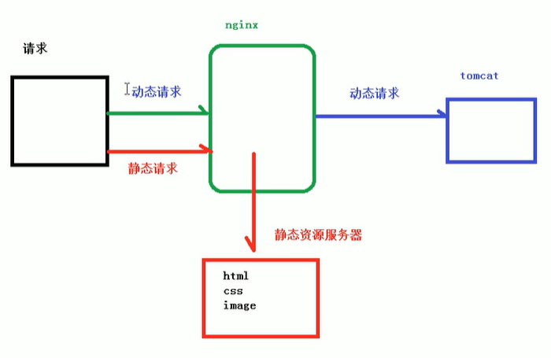

### 动静分离
1. 用nginx处理静态页面,目标服务器处理动态页面


```js
// 配置静态资源
location /www/ {
    # /data/ 是nginx的一个目录,这里请求data/www/index.html或者某个文件
    root   /data/;
    index index.html index.htm;
}
location /image/ {
    root   /data/;
    autoindex on;
}
```